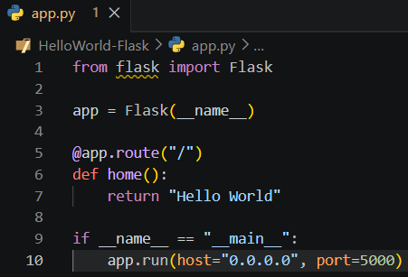
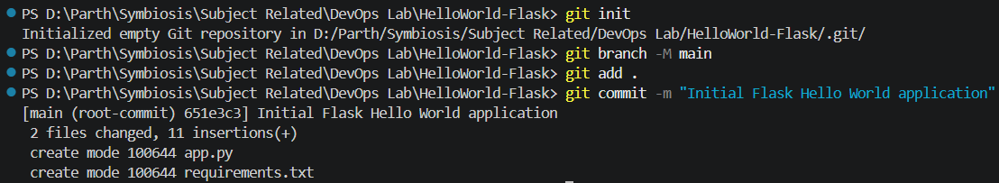
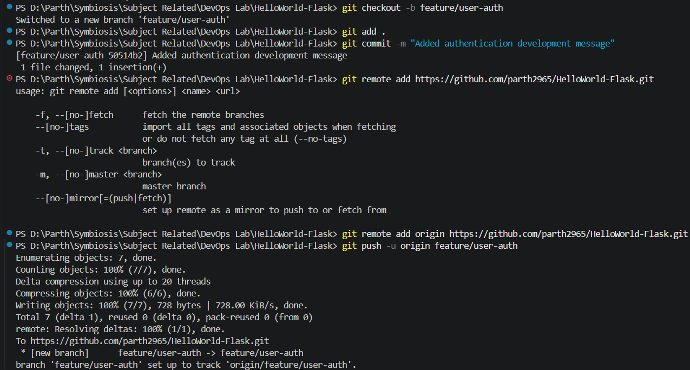
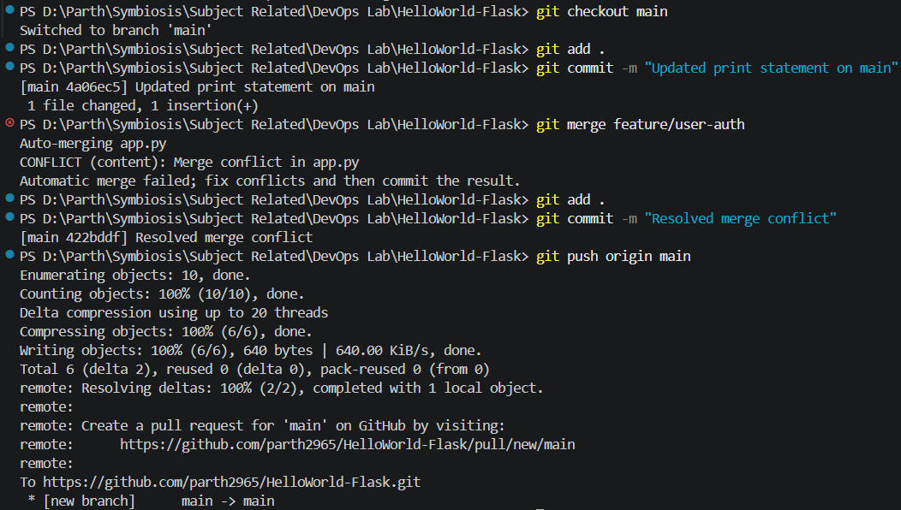

# Assignment TW1.1 - Git Workflow & Collaboration

**Student Name:** Parth Damle  
**PRN:** 23070122161

---

## Objective

The objective of this assignment is to understand the fundamentals of Git version control by creating a simple Flask "Hello World" application, initializing a Git repository, and committing the initial project to the `main` branch.

---

## Tools Used

- Python
- Flask
- Git
- GitHub
- Visual Studio Code

---

## Prerequisites

The following software was installed and configured before starting the assignment:

- Python
- Flask
- Git
- Visual Studio Code
- GitHub Account

---

# Task 1.1 - Initialize Git Repository

## Step 1 - Create Flask Application

A simple Flask application was created to display the message **"Hello World"**.



---

## Step 2 - Initialize Git Repository

The project folder was initialized as a Git repository using Git.

```bash
git init
```



---

## Step 3 - Stage Files and Create Initial Commit

The project files were staged and committed to the repository. The default branch was renamed to **main** before creating the initial commit.

```bash
git branch -M main

git add .

git commit -m "Initial Flask Hello World application"
```



---

## Step 4 - Verify Repository

The Git repository was verified to ensure that the initial commit was created successfully and the project was ready for further development.



---

# Learning Outcomes

Through this assignment, the following Git concepts were successfully implemented:

- Created a simple Flask application.
- Initialized a new Git repository.
- Renamed the default branch to `main`.
- Staged project files using Git.
- Created the initial commit.
- Verified successful repository initialization.

---

# Conclusion

This assignment successfully demonstrated the initial setup of a Git repository for a Python Flask application. The project was initialized, the application source code was added to version control, and the initial commit was created successfully. This established the foundation for subsequent Git workflow tasks involving branching, collaboration, and merge conflict resolution.