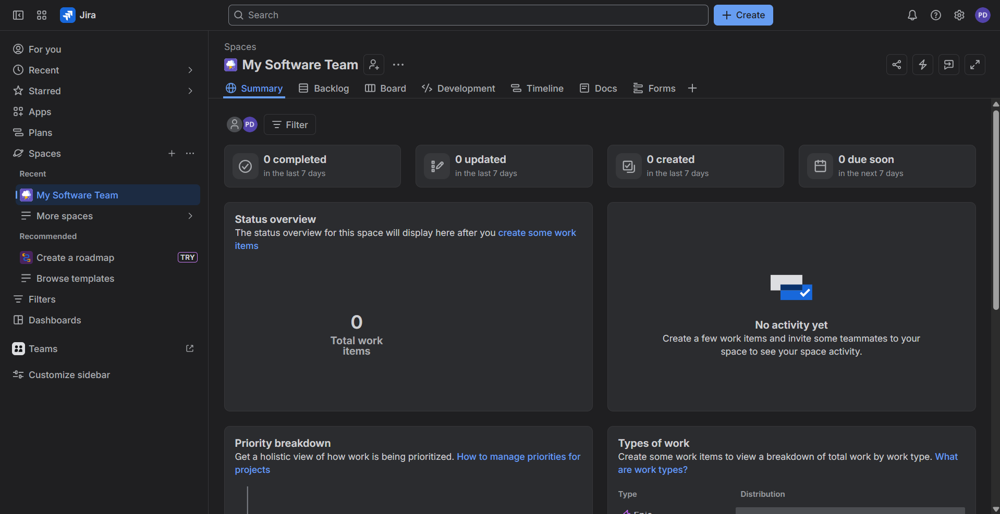
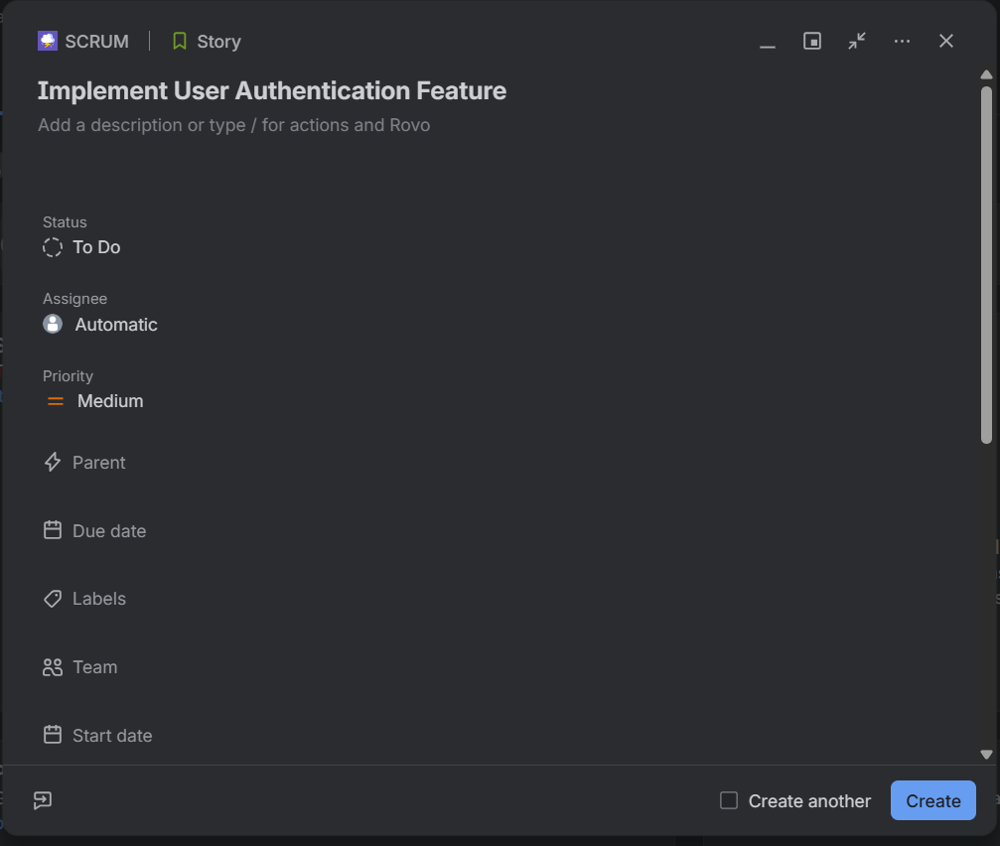
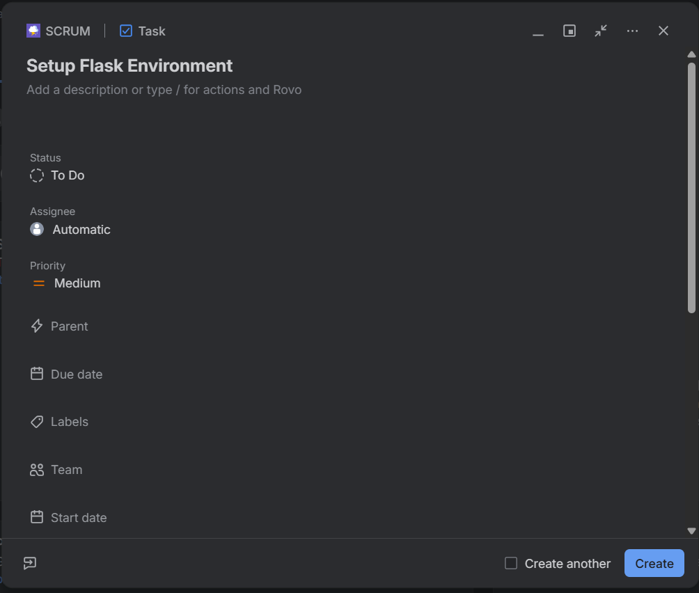
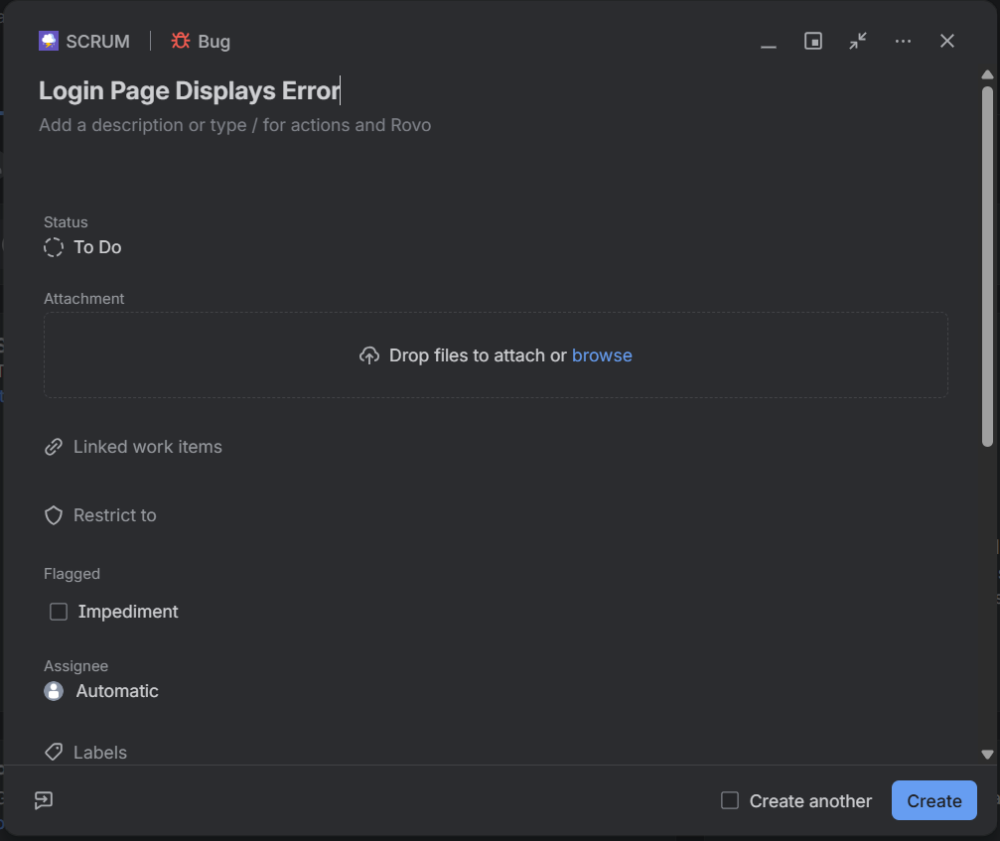
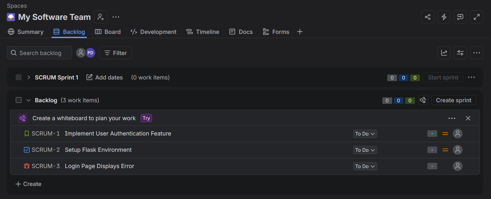
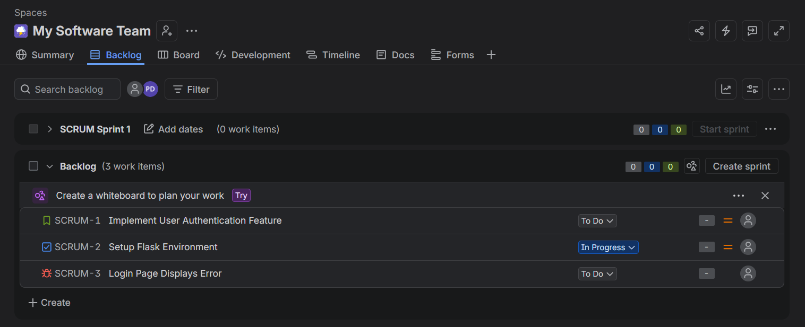

# Assignment TW1.2 - Jira Project & Issue Tracking

## Objective

The objective of this assignment is to understand Agile project management and issue tracking using Jira. A Scrum project was created for the Flask "Hello World" application, and different issue types were created and managed throughout the development process.

---

## Tools Used

- Atlassian Jira Cloud
- Web Browser

---

## Prerequisites

Before starting this assignment, the following were required:

- Atlassian Jira Account
- Internet Connection
- Web Browser

---

# Task 2.1 - Create a Scrum Project

A new **Scrum Project** named **"Hello World Application"** was created in Jira for managing the development of the Flask "Hello World" application.

---

# Task 2.2 - Create Project Issues

## Step 1 - Create Story

A **Story** titled **"Implement User Authentication Feature"** was created to represent a major feature of the application.

---

## Step 2 - Create Task

A **Task** titled **"Setup Flask Environment"** was created to track the environment setup required for the project.

---

## Step 3 - Create Bug

A **Bug** titled **"Login Page Displays Error"** was created to represent an issue that needed to be resolved during development.

---

# Task 2.3 - Update Task Status

## Step 1 - Verify Project Backlog

The project backlog was verified to ensure that all created issues were present before updating their workflow status.

The backlog contained the following issues:

- Story – Implement User Authentication Feature
- Task – Setup Flask Environment
- Bug – Login Page Displays Error

---

## Step 2 - Move Task to In Progress

The **Setup Flask Environment** task was successfully moved from **To Do** to **In Progress** using the Scrum board.

---

# Learning Outcomes

Through this assignment, the following Jira concepts were successfully implemented:

- Creating a Scrum Project
- Creating Story, Task, and Bug issue types
- Managing project issues using the Scrum Backlog
- Updating issue workflow status
- Understanding Agile project management using Jira

---

# Conclusion

This assignment successfully demonstrated the use of Jira Cloud for Agile project management. A Scrum project was created, the required Story, Task, and Bug issues were added, and the project workflow was managed by moving the **Setup Flask Environment** task from **To Do** to **In Progress**. The assignment provided practical experience with Scrum-based issue tracking and Agile project management using Jira.