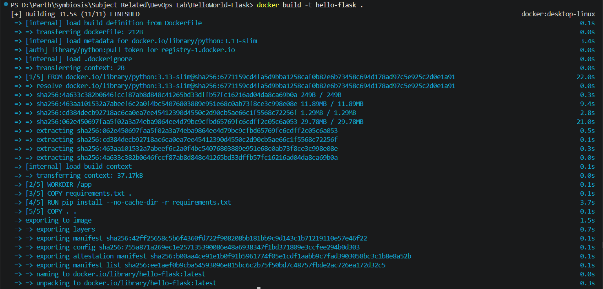
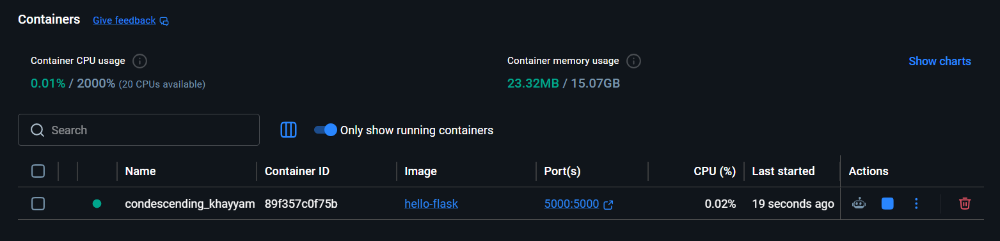
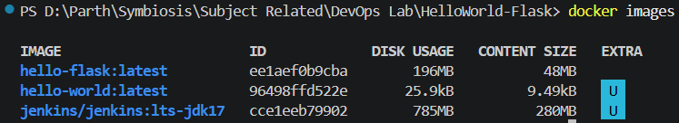
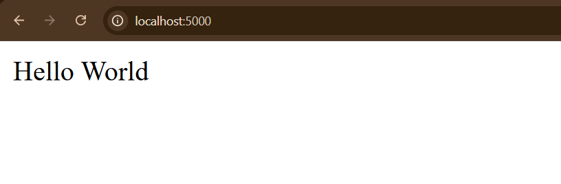
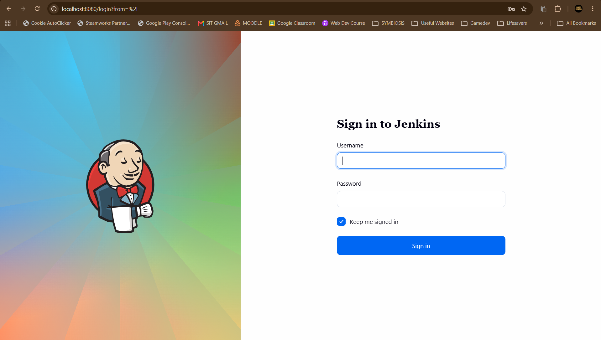
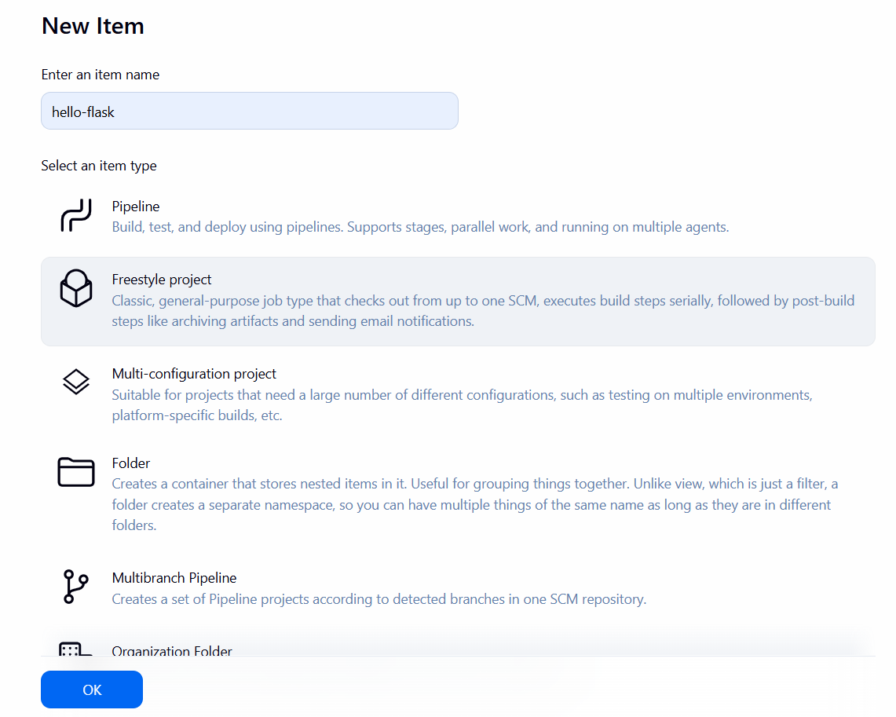
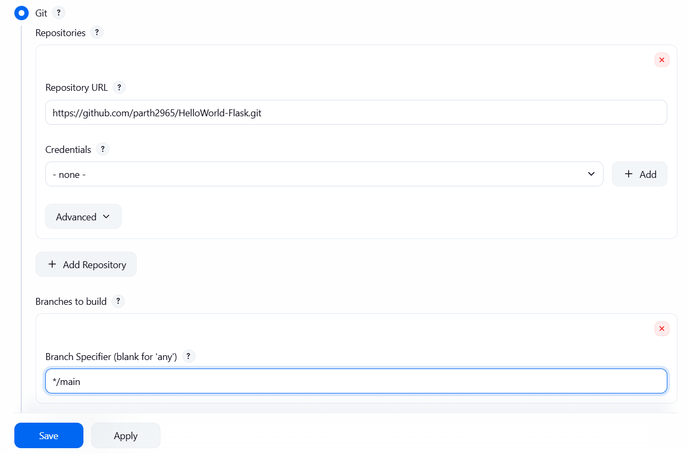
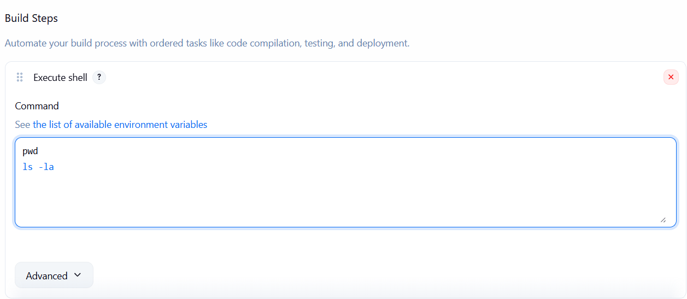
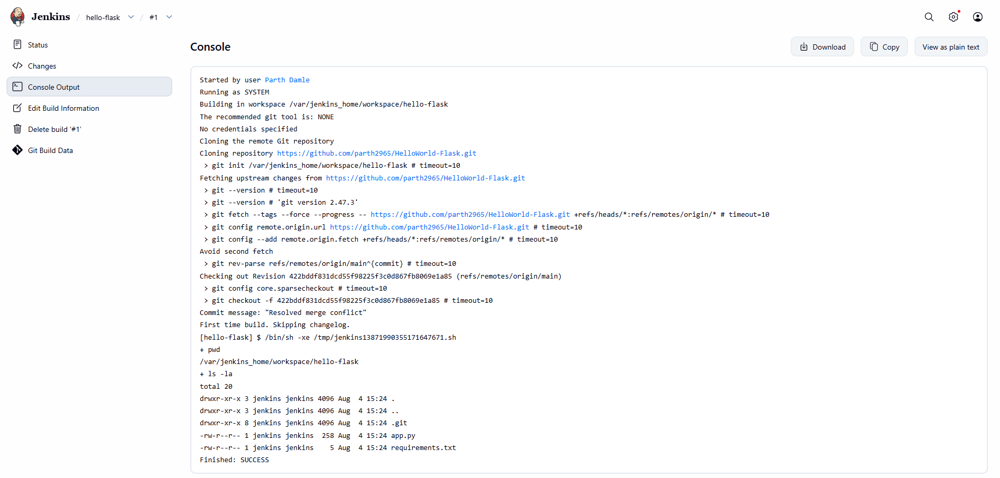
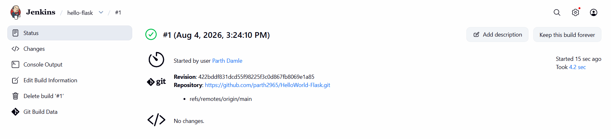

# Assignment TW1.3 - Basic Containerization (Docker) & Jenkins Freestyle Project

**Student Name:** Parth Damle  
**PRN:** 23070122161

---

## Objective

The objective of this assignment is to understand the basics of Docker by containerizing a Python Flask application and to learn Continuous Integration by configuring a Jenkins Freestyle Project.

---

# Software & Tools Used

- Python 3.x
- Flask
- Docker Desktop
- Jenkins
- Git
- GitHub
- Visual Studio Code

---

# Project Structure

The project contains the following files:

```text
HelloWorld-Flask/
│── app.py
│── Dockerfile
│── requirements.txt
└── README.md
```

---

# Task 3.1 - Docker Containerization

## Step 1 - Create Dockerfile

A Dockerfile was created to containerize the Flask application.



---

## Step 2 - Build Docker Image

The following command was executed to build the Docker image.

```bash
docker build -t flask-hello .
```


---

## Step 3 - Verify Docker Image

The available Docker images were verified.

```bash
docker images
```



---

## Step 4 - Run Docker Container

The Docker container was started using the following command.

```bash
docker run -d -p 5000:5000 flask-hello
```



---

## Step 5 - Verify Flask Application

The application was successfully accessed in the browser using:

```text
http://localhost:5000
```

The browser displayed the expected output:

**Hello World**



---

# Task 3.2 - Jenkins Freestyle Project

## Step 1 - Jenkins Login

Jenkins was launched successfully, and the login screen was accessed.



---

## Step 2 - Create Freestyle Project

A new Jenkins Freestyle Project was created.



---

## Step 3 - Configure Project Details

The project details, Git repository URL, and source code management settings were configured successfully.



---

## Step 4 - Configure Build Step

A build step was added to execute commands that list the contents of the Jenkins workspace.

The following command was used:

```cmd
dir
```



---

## Step 5 - Execute Build

The Freestyle Project was executed successfully.

The console output confirmed that:

- The Git repository was cloned successfully.
- The workspace contents were listed.
- The build completed successfully without errors.



---

## Step 6 - Successful Build

The Jenkins build completed successfully.



---

# Commands Used

## Docker Commands

```bash
docker build -t flask-hello .

docker images

docker run -d -p 5000:5000 flask-hello
```

## Jenkins Build Command

```cmd
dir
```

---

# Learning Outcomes

Through this assignment, the following concepts were successfully implemented:

- Created a Dockerfile for a Flask application.
- Built a Docker image.
- Verified the Docker image.
- Executed the Flask application inside a Docker container.
- Verified the application through the browser.
- Configured a Jenkins Freestyle Project.
- Configured build steps in Jenkins.
- Executed a successful Jenkins build.
- Understood the basics of Continuous Integration using Jenkins.

---

# Conclusion

This assignment successfully demonstrated Docker containerization and Jenkins-based Continuous Integration. The Flask application was containerized, executed successfully inside a Docker container, and verified through the browser. A Jenkins Freestyle Project was configured to retrieve the GitHub repository, execute the configured build step, and complete the build successfully, providing practical experience with Docker and Jenkins integration.