# Project 6: Social Media Infrastructure Scalability using Kubernetes

**Student Name:** Pratik Lakra  
**PRN:** 23070122166

---
## Project Description

This project demonstrates application scalability using Kubernetes and Horizontal Pod Autoscaling (HPA). A containerized application was deployed on a local Minikube cluster through a Kubernetes Deployment, exposed using a NodePort Service, and monitored using the Kubernetes Metrics Server. An HPA was configured to automatically scale the number of pods based on CPU utilization, and the scaling behavior was demonstrated under simulated load.

---

## Objective

The objective of this project is to deploy an application on Kubernetes and demonstrate automatic scaling based on CPU utilization using a Horizontal Pod Autoscaler.

---

## Technologies Used

| Technology | Purpose |
|---|---|
| Kubernetes | Container orchestration |
| Minikube | Local Kubernetes cluster |
| kubectl | Kubernetes command-line management |
| Docker | Container image |
| Metrics Server | Resource metrics |
| HPA | Automatic pod scaling |

---

## Prerequisites

- Docker Desktop
- Minikube
- kubectl
- Existing Docker image `retail-store-app:latest`

---

## Kubernetes Architecture

```
                    User
                      │
                      ▼
              NodePort Service
                      │
                      ▼
              Retail Deployment
                      │
        ┌─────────────┼─────────────┐
        │             │             │
        ▼             ▼             ▼
      Pod 1         Pod 2      Pod 3 (created
                                during scaling)
        │             │             │
        └─────────────┼─────────────┘
                      ▼
                Metrics Server
                      │
                      ▼
          Horizontal Pod Autoscaler
                      │
                      ▼
                CPU Utilization
```

The NodePort Service exposes the application outside the cluster and routes traffic to the pods managed by the Deployment. The Metrics Server collects CPU usage data from the running pods, which the Horizontal Pod Autoscaler uses to decide whether the replica count should be increased or decreased.

---

### Step 1 — Starting the Minikube Cluster

Minikube was started using the Docker driver to create a local Kubernetes cluster.

```cmd
minikube start --driver=docker
```

Figure: Minikube cluster started successfully using the Docker driver.

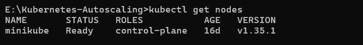

The cluster status and node availability were verified.

```cmd
minikube status
kubectl get nodes
kubectl cluster-info
```

Figure: Minikube status confirming the cluster is running.

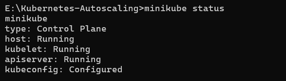

Figure: Cluster information confirming the control plane is accessible.

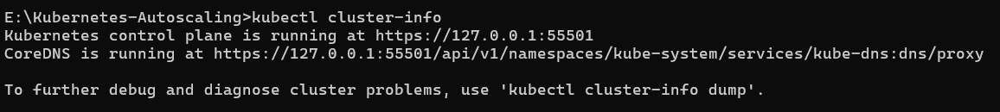

---

### Step 2 — Kubernetes Deployment

A Deployment was created to manage the application pods, defining the container image, resource limits, and initial replica count.

Key configuration:

| Field | Value |
|---|---|
| Deployment name | `retail-deployment` |
| Replicas | `2` |
| Label | `retail-app` |
| Container name | `retail-container` |
| Image | `retail-store-app:latest` |
| Image pull policy | `Never` |
| Container port | `8081` |
| CPU request | `100m` |
| CPU limit | `500m` |

```yaml
apiVersion: apps/v1
kind: Deployment
metadata:
  name: retail-deployment
  labels:
    app: retail-app
spec:
  replicas: 2
  selector:
    matchLabels:
      app: retail-app
  template:
    metadata:
      labels:
        app: retail-app
    spec:
      containers:
        - name: retail-container
          image: retail-store-app:latest
          imagePullPolicy: Never
          ports:
            - containerPort: 8081
          resources:
            requests:
              cpu: 100m
            limits:
              cpu: 500m
```

Figure: Contents of `deployment.yaml`.

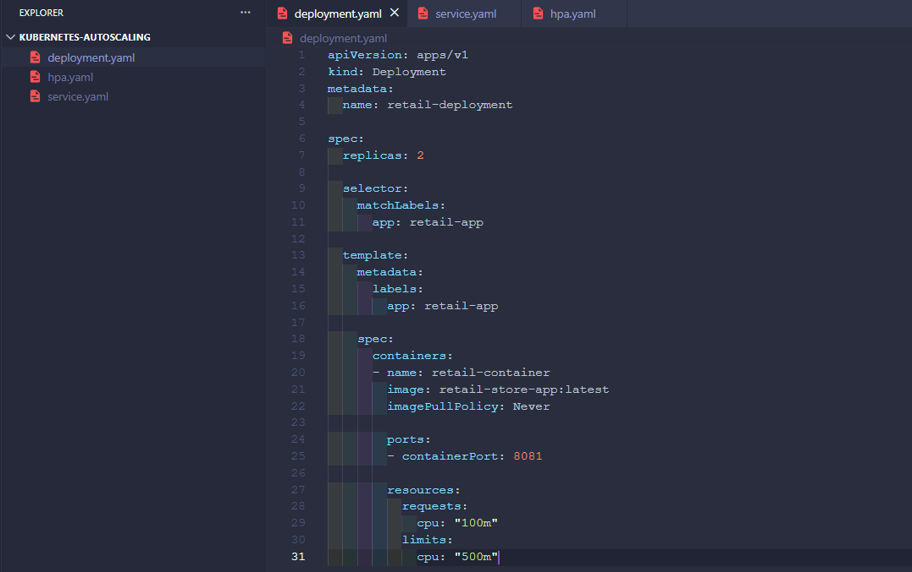

The Deployment was applied to the cluster.

```cmd
kubectl apply -f deployment.yaml
```

Figure: Deployment applied successfully.

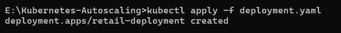

The Deployment and its pods were verified.

```cmd
kubectl get deployments
kubectl get pods
```

Figure: Deployment running with the configured replica count.

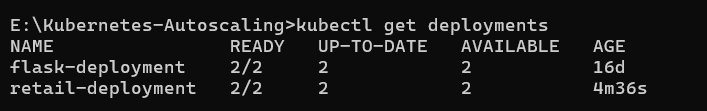

Figure: Pods created by the Deployment in a running state.

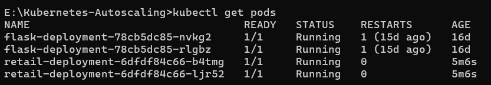

---

### Step 3 — Kubernetes Service

A NodePort Service was created to expose the application outside the cluster.

Key configuration:

| Field | Value |
|---|---|
| Service name | `retail-service` |
| Type | `NodePort` |
| Port | `8081` |
| Target port | `8081` |
| NodePort | `30081` |

```yaml
apiVersion: v1
kind: Service
metadata:
  name: retail-service
spec:
  type: NodePort
  selector:
    app: retail-app
  ports:
    - port: 8081
      targetPort: 8081
      nodePort: 30081
```

Figure: Contents of `service.yaml`.

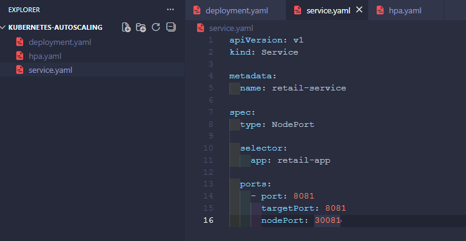

The Service was applied to the cluster.

```cmd
kubectl apply -f service.yaml
```

Figure: Service applied successfully.

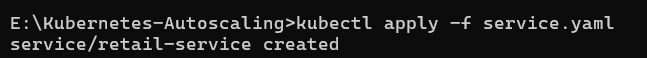

The Service was verified.

```cmd
kubectl get svc
```

Figure: Service listed with its assigned NodePort.

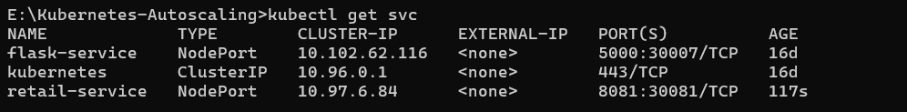

---

### Step 4 — Loading the Docker Image into Minikube

Since Minikube runs its own container runtime, the locally built Docker image was loaded directly into the Minikube environment.

```cmd
minikube image load retail-store-app:latest
```

Verification:

```cmd
minikube image ls | findstr retail
```

Figure: Docker image successfully loaded into the Minikube cluster.

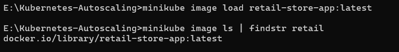

---

### Step 5 — Accessing the Application

The application was exposed through the Minikube NodePort Service.

```cmd
minikube service retail-service --url
```

Figure: Application accessed successfully through the Minikube service URL.

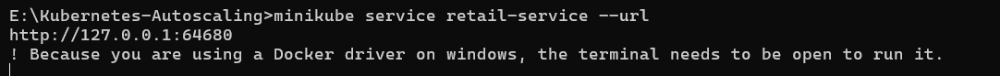

Figure: Application response confirming the service is reachable.

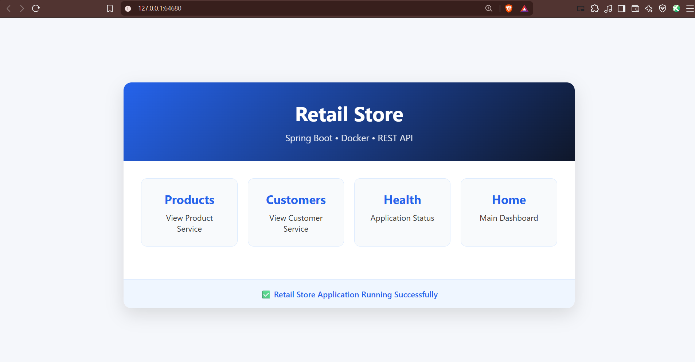

---

### Step 6 — Kubernetes Resources Overview

Before configuring autoscaling, all created resources were reviewed together to confirm the Deployment, Pods, and Service were functioning as expected.

```cmd
kubectl get all
```

Figure: Combined view of the Deployment, ReplicaSet, Pods, and Service.

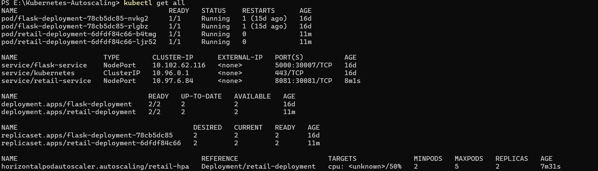

---

### Step 7 — Horizontal Pod Autoscaler

An HPA was configured to automatically scale the Deployment based on CPU utilization.

Key configuration:

| Field | Value |
|---|---|
| HPA name | `retail-hpa` |
| Target | `retail-deployment` |
| Minimum replicas | `2` |
| Maximum replicas | `5` |
| CPU target | `50%` |

```yaml
apiVersion: autoscaling/v2
kind: HorizontalPodAutoscaler
metadata:
  name: retail-hpa
spec:
  scaleTargetRef:
    apiVersion: apps/v1
    kind: Deployment
    name: retail-deployment
  minReplicas: 2
  maxReplicas: 5
  metrics:
    - type: Resource
      resource:
        name: cpu
        target:
          type: Utilization
          averageUtilization: 50
```

Figure: Contents of `hpa.yaml`.

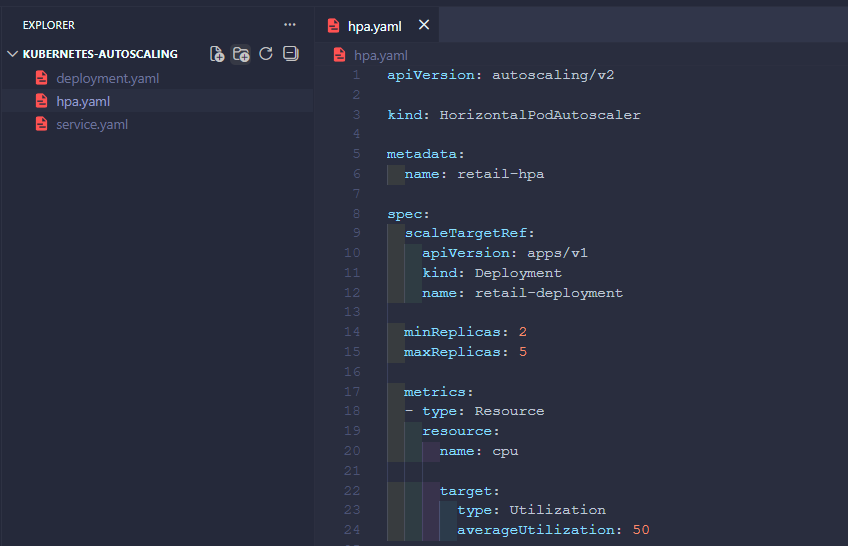

The HPA was applied to the cluster.

```cmd
kubectl apply -f hpa.yaml
```

Figure: HPA applied successfully.

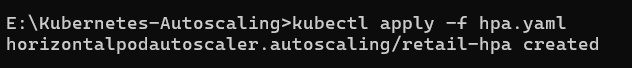

The HPA was verified.

```cmd
kubectl get hpa
```

Figure: HPA created and targeting the retail deployment.

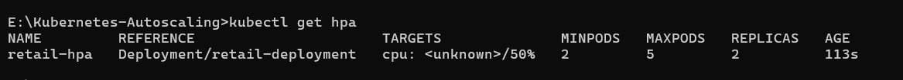

---

### Step 8 — Post-Configuration Resource Check

With the Deployment, Service, and HPA all in place, the cluster resources were re-verified as a checkpoint before enabling the Metrics Server.

```cmd
kubectl get deployments
kubectl get pods
kubectl get svc
kubectl get hpa
```

Figure: Deployment confirmed running with the expected replica count.

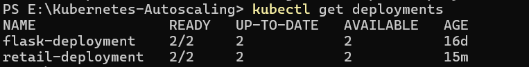

Figure: Pods confirmed running.

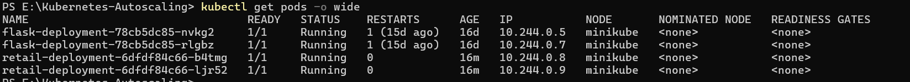

Figure: Service confirmed exposing the application.

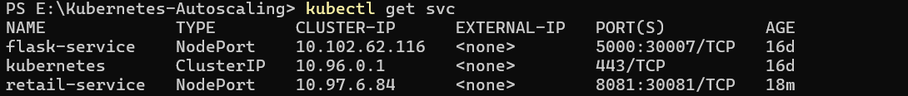

Figure: HPA confirmed created and targeting the Deployment.

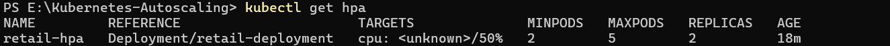

Figure: Combined resource view at this checkpoint.

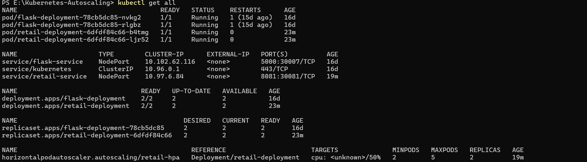

---

### Step 9 — Metrics Server

The Metrics Server is required for the HPA to retrieve CPU utilization data from running pods, since CPU-based scaling decisions depend on live resource metrics.

```cmd
minikube addons enable metrics-server
```

Figure: Metrics Server addon enabled.

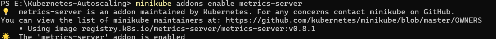

Figure: Metrics Server running in the cluster.

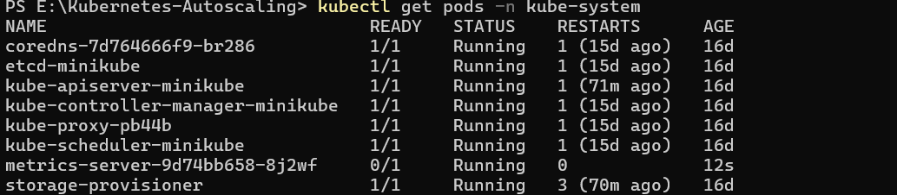

Node and pod metrics were verified.

```cmd
kubectl top nodes
kubectl top pods
```

Figure: Node-level CPU and memory metrics.

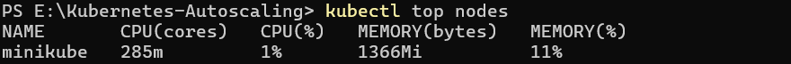

Figure: Pod-level CPU and memory metrics.

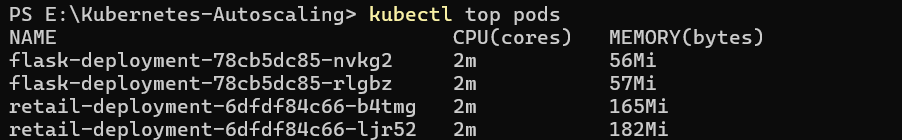

HPA metrics were then re-checked.

```cmd
kubectl get hpa
```

Figure: HPA reporting live CPU utilization after Metrics Server became available.

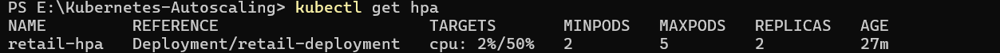

Before the Metrics Server was enabled, the HPA displayed CPU utilization as `<unknown>`. Once the Metrics Server became active, the HPA began reporting actual CPU utilization values, such as `2%/50%`.

---

### Step 10 — Autoscaling Demonstration

CPU load was generated against the application to trigger the Horizontal Pod Autoscaler and demonstrate automatic scaling.

The HPA and pods were monitored in real time.

```cmd
kubectl get hpa -w
kubectl get pods -w
```

Figure: CPU utilization rising as load was applied to the application.

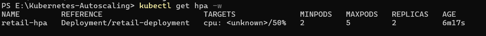

Figure: HPA responding to increased CPU utilization by scaling the Deployment.

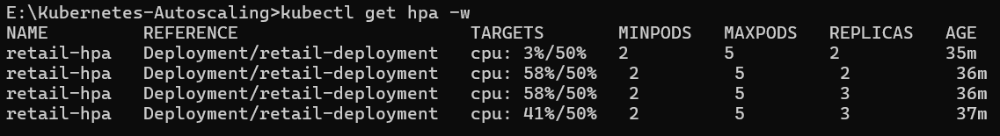

Figure: New pod created by the HPA as replica count increased.

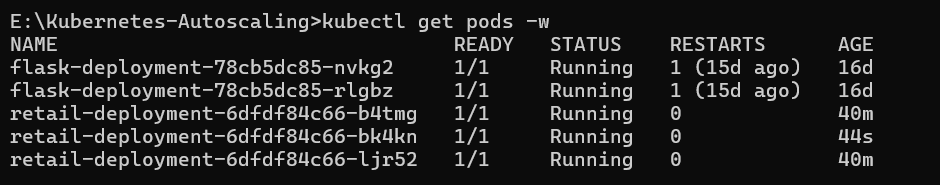

The Deployment initially ran with 2 replicas and automatically scaled to 3 replicas as CPU utilization increased. The application remained accessible through the NodePort Service throughout the scaling event.

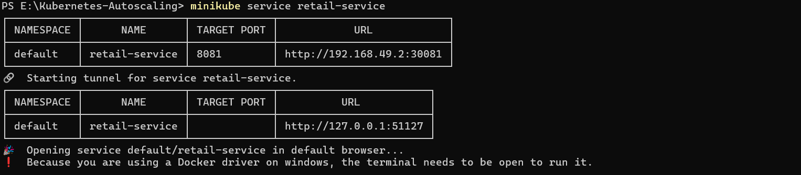


---

### Step 11 — Final Kubernetes State

The final state of the cluster was reviewed to confirm all resources were functioning correctly after the autoscaling demonstration.

```cmd
kubectl get all
```

Figure: Final cluster state showing the Deployment, ReplicaSet, Pods, Service, and HPA.

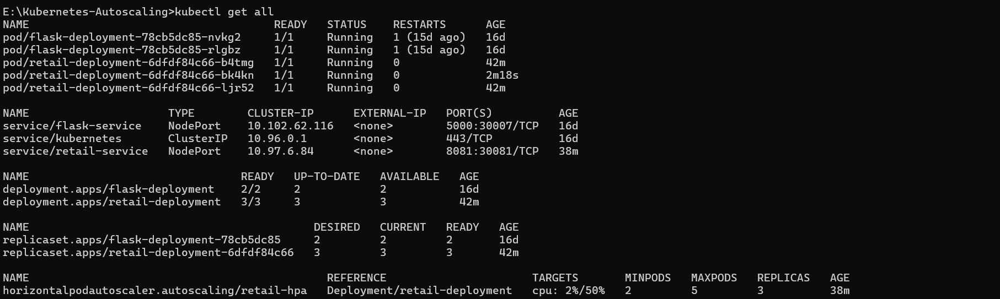

Figure: Cleaned final cluster state summary.

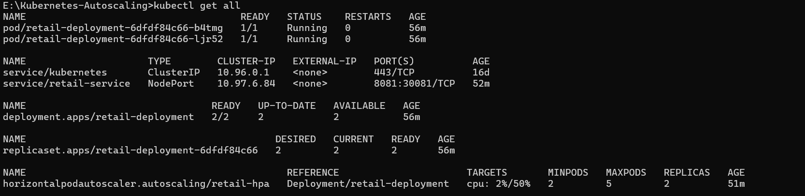

Final observed values:

| Field | Value |
|---|---|
| Desired replicas | `3` |
| Current replicas | `3` |
| Ready replicas | `3` |
| HPA minimum | `2` |
| HPA maximum | `5` |
| CPU target | `50%` |

---

## Kubernetes Workflow

```
Docker Image
     │
     ▼
Minikube
     │
     ▼
Deployment
     │
     ▼
Pods
     │
     ▼
NodePort Service
     │
     ▼
Application
     │
     ▼
Metrics Server
     │
     ▼
HPA monitors CPU
     │
     ▼
CPU Load Increases
     │
     ▼
Replica Count Increases
     │
     ▼
Application Scales Automatically
```

The Docker image is loaded into Minikube and deployed through a Deployment, which creates and manages the application pods. A NodePort Service exposes these pods to external traffic. The Metrics Server continuously collects CPU usage data, which the HPA monitors against its configured target. When CPU load increases beyond the target threshold, the HPA increases the replica count, allowing the Deployment to scale automatically.

---

## Commands Used

### Minikube

```cmd
minikube start --driver=docker
minikube status
minikube cluster-info
minikube image load retail-store-app:latest
minikube service retail-service
minikube addons enable metrics-server
```

### Kubernetes

```cmd
kubectl get nodes
kubectl apply -f deployment.yaml
kubectl apply -f service.yaml
kubectl apply -f hpa.yaml
kubectl get deployments
kubectl get pods
kubectl get pods -o wide
kubectl get svc
kubectl get hpa
kubectl get all
```

### Monitoring

```cmd
kubectl top nodes
kubectl top pods
kubectl get hpa -w
kubectl get pods -w
```

---

## Build Result

```
Build Result

The Kubernetes autoscaling infrastructure executed successfully.

Minikube Cluster: RUNNING
Deployment Created: SUCCESS
Service Created: SUCCESS
Horizontal Pod Autoscaler Created: SUCCESS
Metrics Server Enabled: SUCCESS
Application Accessible: SUCCESS
Autoscaling Demonstrated: SUCCESS

Final Pipeline Status: NOT APPLICABLE
Final Kubernetes Status: SUCCESS
```

---

## Learning Outcomes

- Kubernetes Deployment management
- Kubernetes Services and NodePort
- Minikube-based local clusters
- Metrics Server
- Horizontal Pod Autoscaling
- CPU-based resource monitoring
- Automatic replica scaling
- kubectl resource management

---

## Conclusion

This project successfully demonstrated Kubernetes-based application scalability using a Minikube cluster, a Deployment, a NodePort Service, and a Horizontal Pod Autoscaler. The Metrics Server enabled CPU-based monitoring, and the HPA responded to increased CPU utilization by scaling the retail application's replicas from 2 to 3 during the load test, confirming that the autoscaling infrastructure functioned as intended.