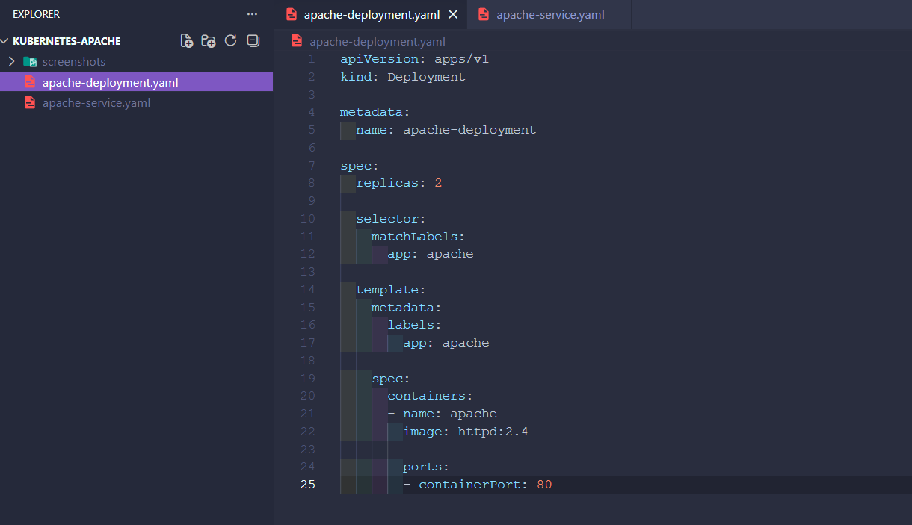
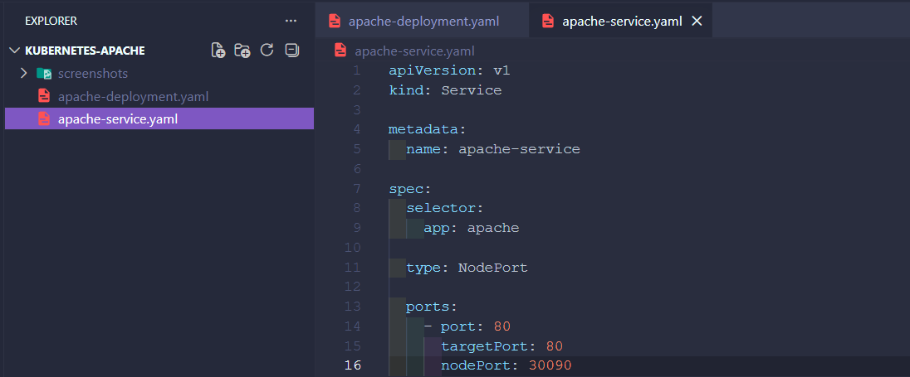
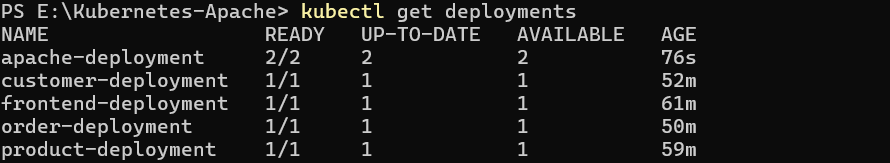
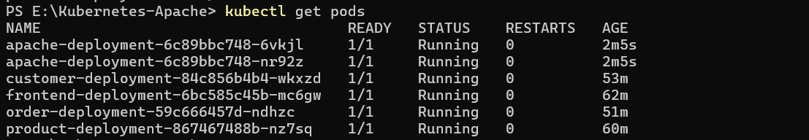
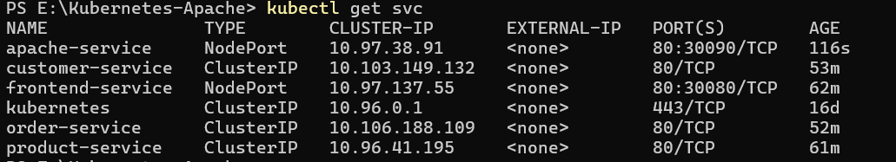
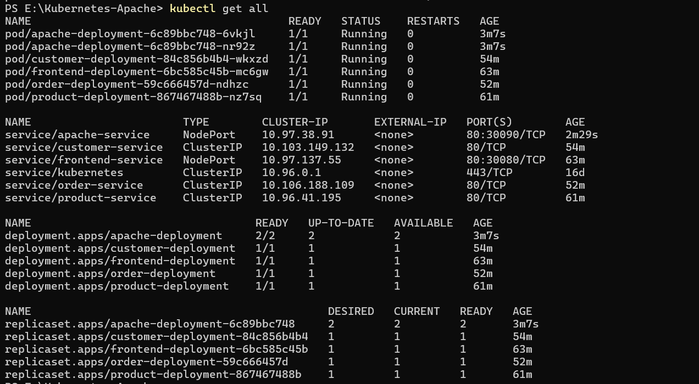
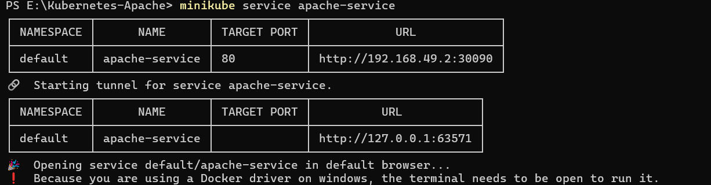
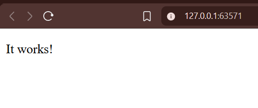
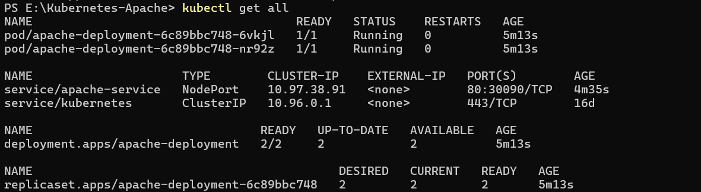

# Project 9: Apache Web Server Deployment on Kubernetes

**Student Name:** Pratik Lakra  
**PRN:** 23070122166
## Project Description

This project demonstrates the deployment of the Apache HTTP Web Server on Kubernetes using a Deployment resource and exposing it externally through a NodePort Service. Kubernetes manages container deployment, scaling, and networking, while Apache serves as the web server delivering content to end users.

## Objective

- Deploy Apache HTTP Server using Kubernetes Deployment
- Expose the application through a NodePort Service
- Verify pod creation and service availability
- Access the Apache web page from a browser
- Understand Kubernetes Deployments and Services

## Technologies Used

| Technology | Purpose |
|---|---|
| Kubernetes | Container orchestration platform |
| Minikube | Local Kubernetes cluster |
| kubectl | Kubernetes command-line tool |
| Docker | Containerization platform |
| Apache HTTP Server (httpd) | Web server application |
| YAML | Configuration file format |

## Prerequisites

- Docker Desktop
- Minikube
- kubectl
- Kubernetes Cluster
- Apache HTTP Server Docker Image

## Project Structure

```
Project-9/
│
├── apache-deployment.yaml
├── apache-service.yaml
│
├── Screenshots/
│
├── README.md
│
└── .gitignore
```

- **apache-deployment.yaml**: Defines the Apache Deployment, including replica count and container image.
- **apache-service.yaml**: Defines the NodePort Service used to expose Apache externally.
- **Screenshots/**: Contains screenshots captured during implementation and verification.
- **README.md**: Project documentation.
- **.gitignore**: Specifies files and folders excluded from version control.

## Kubernetes Architecture

```
Browser
   │
   ▼
Apache Service (NodePort)
   │
   ▼
Apache Deployment
   │
   ▼
Apache Pods (2 Replicas)
```

## Implementation

### Step 1: Create Apache Deployment

A Kubernetes Deployment was created to manage the Apache HTTP Server pods, ensuring the desired number of replicas are running and automatically replaced if they fail.

```yaml
apiVersion: apps/v1
kind: Deployment
metadata:
  name: apache-deployment
  labels:
    app: apache
spec:
  replicas: 2
  selector:
    matchLabels:
      app: apache
  template:
    metadata:
      labels:
        app: apache
    spec:
      containers:
        - name: apache
          image: httpd:latest
          ports:
            - containerPort: 80
```


The Deployment YAML file defining the Apache container image, replica count, and port configuration.

### Step 2: Create Apache Service

A NodePort Service was created to expose the Apache Deployment outside the cluster, allowing access to the web server through a browser.

```yaml
apiVersion: v1
kind: Service
metadata:
  name: apache-service
spec:
  type: NodePort
  selector:
    app: apache
  ports:
    - port: 80
      targetPort: 80
      nodePort: 30080
```


The Service YAML file configuring the NodePort type to expose the Apache Deployment externally.

### Step 3: Deploy Resources

The Deployment and Service were applied to the Kubernetes cluster using the following commands.

```bash
kubectl apply -f apache-deployment.yaml
kubectl apply -f apache-service.yaml
```


Confirmation that the Apache Deployment was created successfully in the cluster.


Confirmation that the Apache Service was created successfully in the cluster.

### Step 4: Verify Kubernetes Resources

The Deployment, Pods, and Service were verified to ensure they were running as expected.

```bash
kubectl get deployments
kubectl get pods
kubectl get svc
kubectl get all
```


Output showing the Apache Deployment is running with the desired number of replicas.


Output showing both Apache pods are in the Running state.


Output showing the Apache Service running with its assigned NodePort.


Combined output listing all active Kubernetes resources related to the Apache deployment.

### Step 5: Access Apache Web Server

The Apache web server was accessed using Minikube's service command, which opens the exposed NodePort Service in the default browser.

```bash
minikube service apache-service
```

or

```bash
minikube service apache-service --url
```

The default Apache HTTP Server welcome page was successfully displayed, confirming that the Deployment and Service were configured correctly.


The Apache HTTP Server default welcome page accessed through the browser.
 

Another view of the Apache HTTP Server welcome page confirming successful access.
 

### Step 6: Final Cluster State

Resources from previous projects were cleaned up before capturing the final cluster state so that only the Apache deployment and related Kubernetes resources are displayed.

```bash
kubectl get all
```


The final cluster state showing only the Apache Deployment, Pods, and Service.

## Kubernetes Workflow

```
Apache Deployment
      ↓
Apache Pods (2 Replicas)
      ↓
Apache Service (NodePort)
      ↓
Browser Access
```

The Apache Deployment creates and manages the Apache Pods, which run the web server containers. The NodePort Service exposes these pods to external traffic, allowing the application to be accessed through a browser.

## Kubernetes Components Used

| Component | Purpose |
|---|---|
| Deployment | Manages the desired state and lifecycle of Apache pods |
| Service | Exposes the Apache Deployment to network traffic |
| NodePort | Opens a static port on each node to allow external access |
| Pod | Runs the Apache container instance |
| ReplicaSet | Ensures the specified number of pod replicas are running |

## Commands Used

### Deployment Commands

```bash
kubectl apply -f apache-deployment.yaml
kubectl apply -f apache-service.yaml
```

### Verification Commands

```bash
kubectl get deployments
kubectl get pods
kubectl get svc
kubectl get all
```

### Application Access

```bash
minikube service apache-service
minikube service apache-service --url
```

## Build Result

### Build Result

Apache Deployment Created: SUCCESS

Apache Service Created: SUCCESS

Pods Running Successfully

Apache Web Server Accessible Successfully

Final Kubernetes Cluster Status: SUCCESS

## Learning Outcomes

- Kubernetes Deployments
- Services
- NodePort
- Pod Management
- ReplicaSets
- Container Deployment
- Application Verification
- Browser Access through Kubernetes

## Conclusion

This project successfully demonstrated deploying the Apache HTTP Server on Kubernetes using Deployments and Services. The application was successfully exposed through a NodePort Service, verified through Kubernetes resources, and accessed from a web browser, reinforcing core concepts of Kubernetes container orchestration.