# Assignment TW1.1 - Git Workflow & Collaboration

## Objective

The objective of this assignment is to understand the fundamentals of Git version control by creating a Flask application, initializing a Git repository, working with branches, resolving merge conflicts, and pushing the project to GitHub.

---

## Tools Used

- Python
- Flask
- Git
- GitHub
- Visual Studio Code

---

## Prerequisites

The following software was installed and configured before starting the assignment:

- Python
- Git
- Visual Studio Code
- GitHub Account

---

# Task 1.1 - Initialize Git Repository

## Step 1 - Project Structure

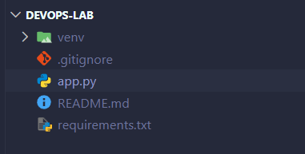

---

## Step 2 - Flask Application (app.py)

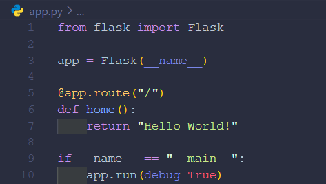

---

## Step 3 - Create and Activate Virtual Environment

The virtual environment was activated and all required packages were installed using the requirements file.

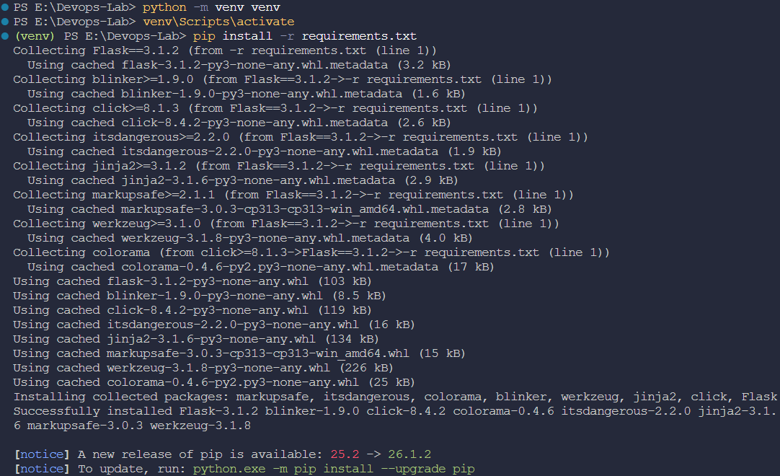

---

## Step 4 - Run Flask Application

The Flask application was executed successfully.

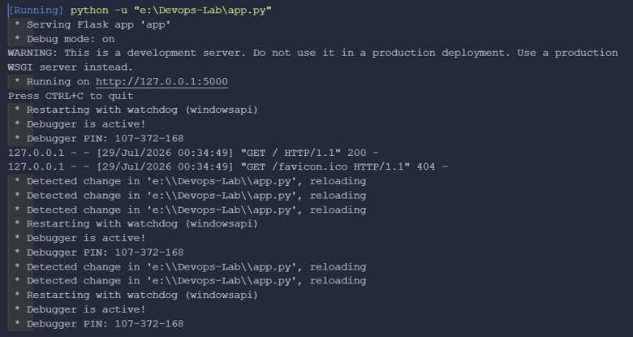

---

## Step 5 - Verify Application in Browser

The application was verified by opening it in the browser at:

http://127.0.0.1:5000

The application displayed the expected output:

**Hello World!**

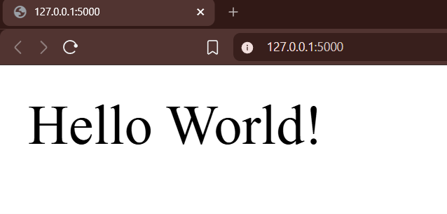

---

# Task 1.2 - Git Workflow

## Step 6 - Initialize Git Repository

```bash
git init
```

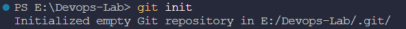

---

## Step 7 - Rename Default Branch to Main

```bash
git branch -M main
```

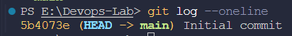

---

## Step 8 - Verify Current Branch

```bash
git branch
```

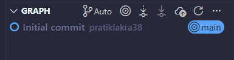

---

## Step 9 - Add Remote Repository

```bash
git remote add origin <repository-url>
```

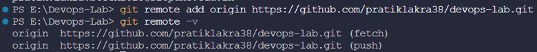

---

## Step 10 - Verify Remote Repository

```bash
git remote -v
```


---

## Step 11 - Push Initial Commit

```bash
git push -u origin main
```

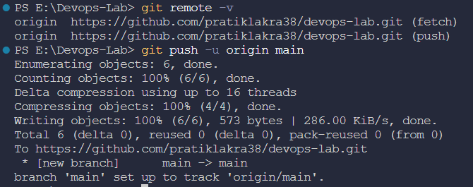

---

## Step 12 - Verify GitHub Repository

The repository was successfully pushed to GitHub.


---

# Task 1.3 - Branching and Merge Conflict

## Step 13 - Create Feature Branch

```bash
git checkout -b feature/user-auth
```

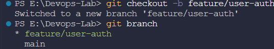

---

## Step 14 - Run Application after Feature Changes

The Flask application was executed again to verify the changes made in the feature branch.

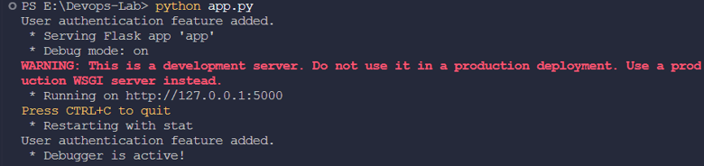

---

## Step 15 - Commit Changes in Feature Branch

```bash
git add .
git commit -m "Added user authentication feature"
```

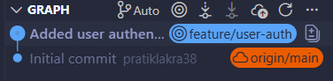

---

## Step 16 - Verify Git Log

```bash
git log --oneline --graph --all
```

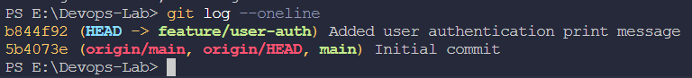

---

## Step 17 - Push Feature Branch

```bash
git push origin feature/user-auth
```

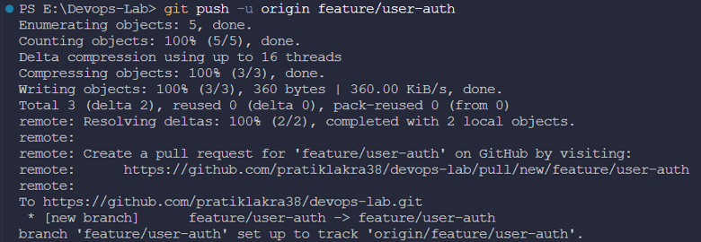

---

## Step 18 - Modify Application

The application was modified on the main branch to intentionally create a merge conflict.

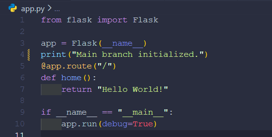

---

## Step 19 - Merge Conflict

While merging the feature branch into the main branch, Git detected a merge conflict.

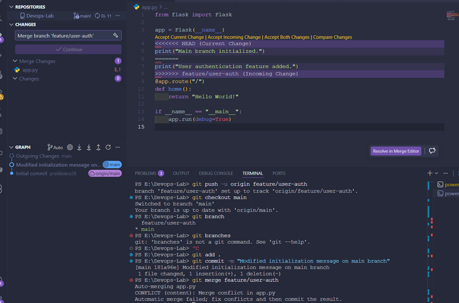

---

## Step 20 - Resolve Merge Conflict

The conflict was manually resolved in Visual Studio Code.

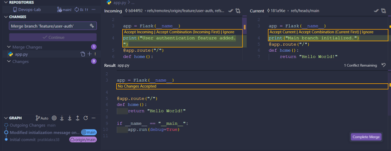

---

## Step 21 - Commit Merge Resolution

After resolving the conflict, the merge commit was completed successfully.

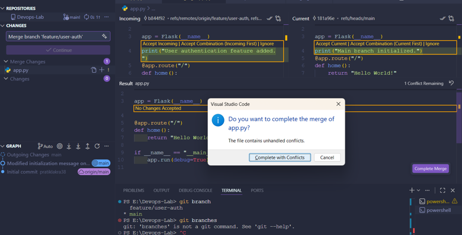

---

## Step 22 - Confirm Successful Merge

The merge was verified successfully.

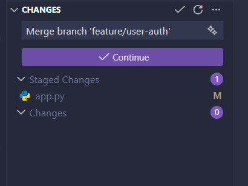

---

## Step 23 - Verify Branches

```bash
git branch -a
```

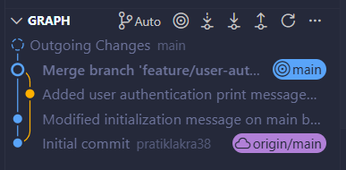

---

## Step 24 - Final GitHub Repository

The final repository contains all commits after resolving the merge conflict.

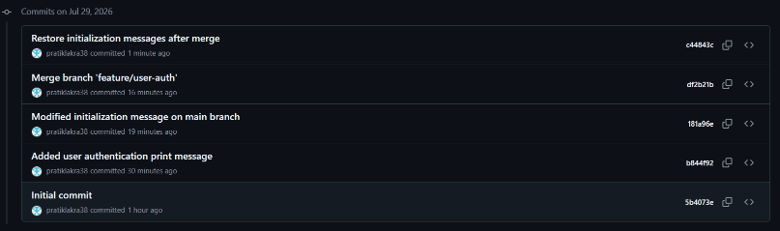

---

# Learning Outcomes

Through this assignment, the following Git concepts were successfully implemented:

- Repository initialization
- Git branching
- Feature branch workflow
- GitHub remote repository
- Commit history
- Merge conflict simulation
- Manual conflict resolution
- Final merge verification

---

# Conclusion

This assignment successfully demonstrated a complete Git workflow using a Python Flask application. A feature branch was created, changes were committed, a merge conflict was intentionally generated and manually resolved, and the final project was pushed to GitHub. The assignment helped in understanding collaborative development workflows using Git and GitHub.