# Assignment TW1.3 - Basic Containerization (Docker) & Jenkins Freestyle Project

## Objective

The objective of this assignment is to understand the basics of Docker by containerizing a Python Flask application and to learn Continuous Integration by configuring a Jenkins Freestyle Project.

---

# Software & Tools Used

- Python 3.x
- Flask
- Docker Desktop
- Jenkins
- Git & GitHub
- Visual Studio Code

---

# Project Structure

The project contains the following files:

```text
Devops-Lab/
│── app.py
│── Dockerfile
│── requirements.txt
│── .gitignore
```

---

# Task 3.1 - Docker Containerization

## Step 1 - Flask Application

A simple Flask "Hello World" application was created.

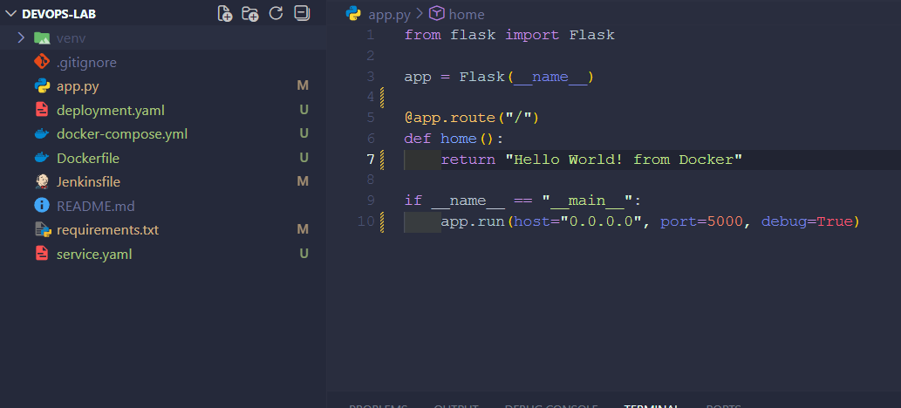

---

## Step 2 - Dockerfile

A Dockerfile was created to containerize the Flask application.

```dockerfile
FROM python:3.13-slim

WORKDIR /app

COPY requirements.txt .

RUN pip install --no-cache-dir -r requirements.txt

COPY . .

EXPOSE 5000

CMD ["python", "app.py"]
```

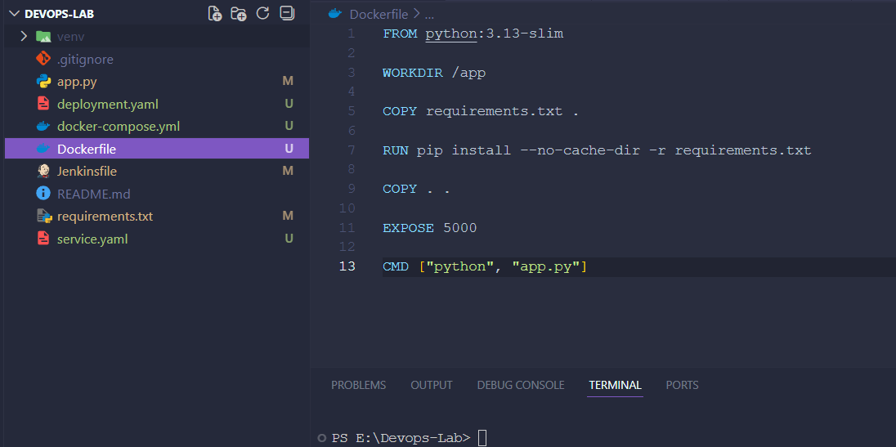

---

## Step 3 - Build Docker Image

The following command was executed to build the Docker image.

```bash
docker build -t hello-flask .
```

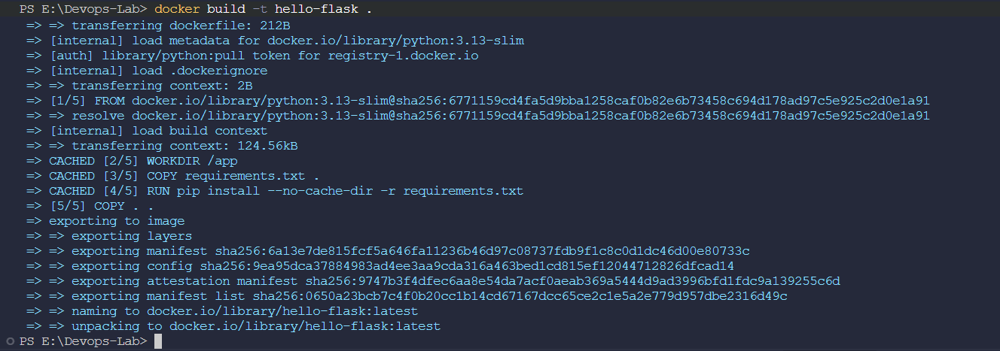

---

## Step 4 - Verify Docker Image

The available Docker images were verified.

```bash
docker images
```

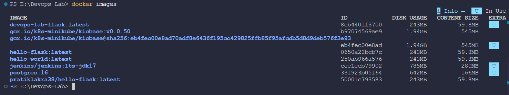

---

## Step 5 - Run Docker Container

The Docker container was started using the following command.

```bash
docker run -d -p 5000:5000 hello-flask
```


---

## Step 6 - Verify Flask Application

The application was successfully accessed in the browser using:

```text
http://localhost:5000
```

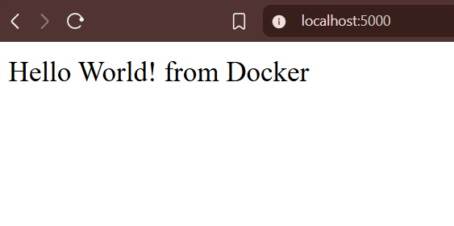

---

# Task 3.2 - Jenkins Freestyle Project

## Step 1 - Jenkins Dashboard

Jenkins was launched successfully and the dashboard was accessed.

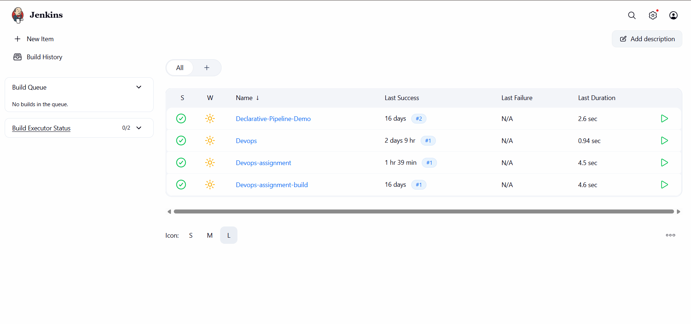

---

## Step 2 - Configure Freestyle Project

A Jenkins Freestyle Project was created and configured.

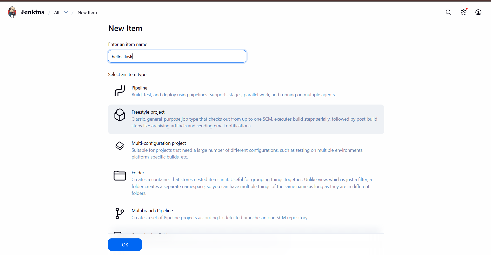

---

## Step 3 - Configure Source Code Management

The GitHub repository was configured under **Source Code Management**.

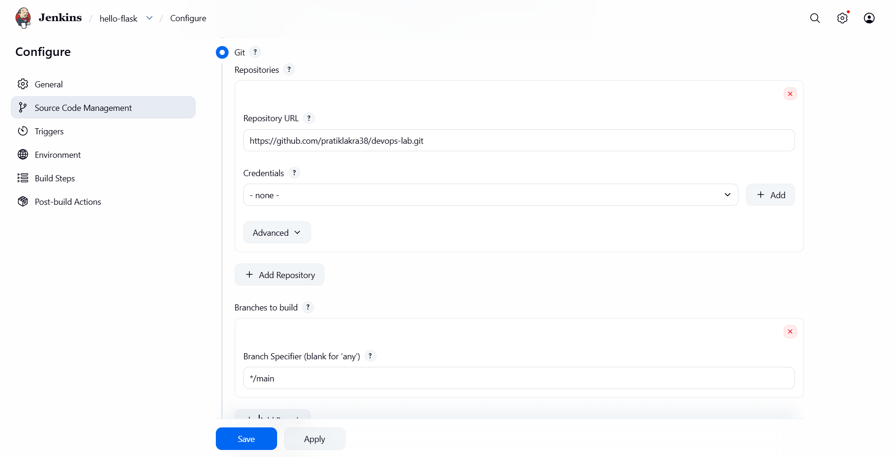

---

## Step 4 - Configure Build Step

A build step was added to execute shell/batch commands.

Example commands used:

```bash
pwd
ls -la
```

*(On Windows Jenkins, equivalent batch commands such as `cd` and `dir` may be used.)*

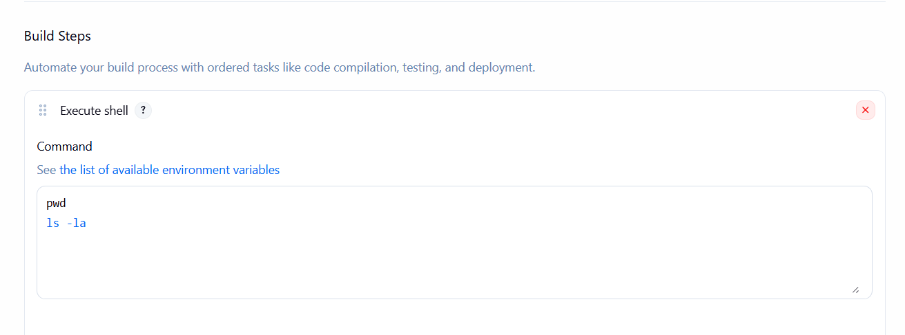

---

## Step 5 - Execute Build

The Freestyle Project was executed successfully.

The console output verified that:

- Repository was cloned successfully.
- Workspace contents were listed.
- Build completed without errors.

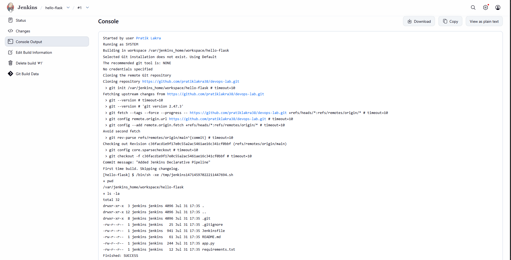

---

## Step 6 - Successful Build

The Jenkins build completed successfully.

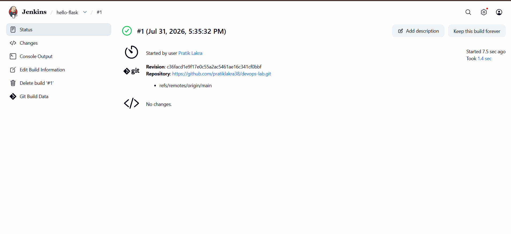

---

# Commands Used

## Docker Commands

```bash
docker build -t hello-flask .

docker images

docker run -d -p 5000:5000 hello-flask
```

## Jenkins Build Commands

```bash
pwd

ls -la
```

*(Windows Batch Alternative)*

```cmd
cd

dir
```

---

# Learning Outcomes

Through this assignment, the following concepts were successfully implemented:

- Created a Dockerfile for a Flask application.
- Built a Docker image.
- Executed the Flask application inside a Docker container.
- Verified the application through the browser.
- Configured a Jenkins Freestyle Project.
- Connected Jenkins with a GitHub repository.
- Executed a successful Jenkins build.
- Understood the basics of Continuous Integration using Jenkins.

---

# Result

The Flask application was successfully containerized using Docker and executed locally on port **5000**. A Jenkins Freestyle Project was configured to fetch the GitHub repository and execute the required build steps successfully, demonstrating the basic workflow of Docker containerization and Continuous Integration.