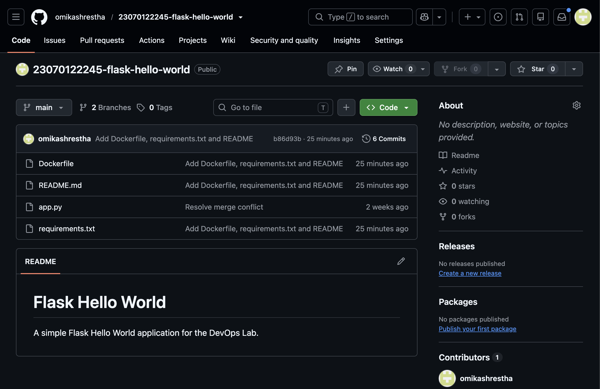
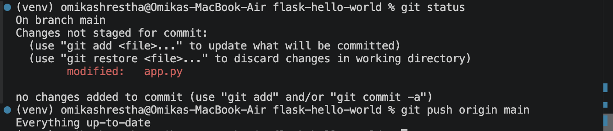
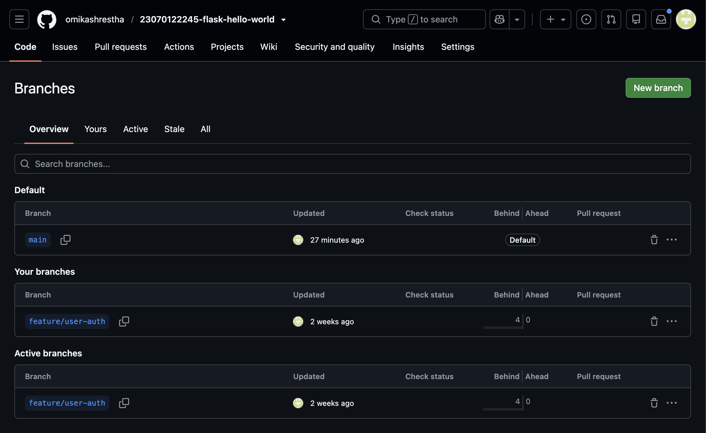
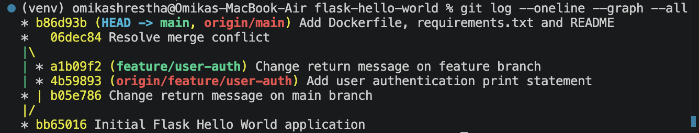

# Assignment TW1.1 – Git Workflow & Collaboration

## Objective

To learn Git basics including repository creation, branching, merging, conflict resolution and GitHub integration.

## Tasks Completed

- Initialized a Git repository
- Added Flask Hello World application
- Created feature/user-auth branch
- Modified the application
- Committed changes
- Pushed to GitHub
- Simulated merge conflict
- Resolved merge conflict
- Pushed updated main branch

## Screenshots

### GitHub Repository

---

### Git Status

---

### Feature Branch

---

### Git Log

---

### Merge Conflict / Merge History

