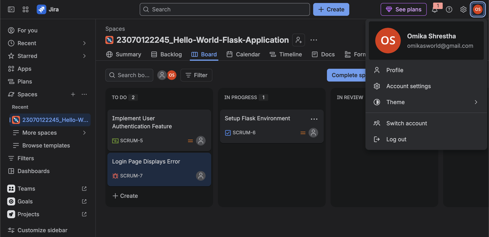
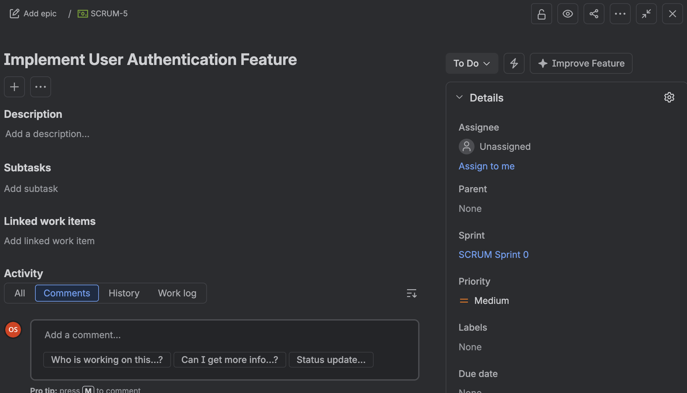
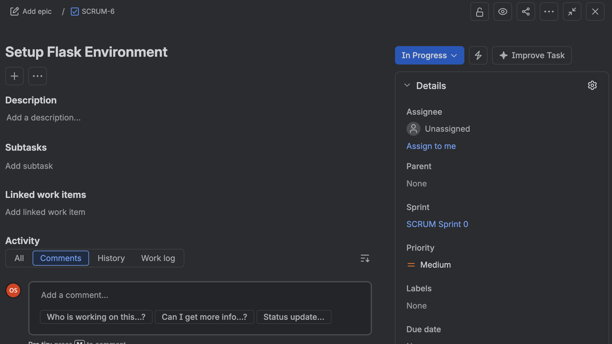
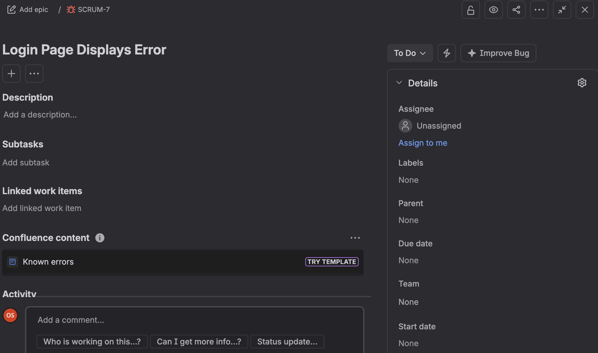

# Assignment TW1.2 – Jira Project & Issue Tracking

## Objective

To create and manage project issues using Jira Scrum.

## Tasks Completed

- Created Scrum Project
- Created Story
- Created Task
- Created Bug
- Moved Task from To Do to In Progress

## Screenshots

### Scrum Project

---

### Story – Implement User Authentication Feature

---

### Task – Setup Flask Environment

---

### Bug – Login Page Displays Error

