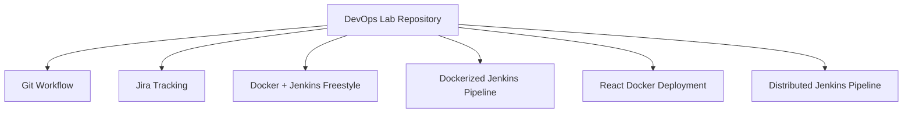
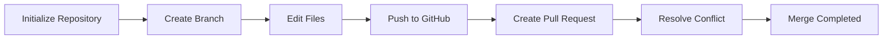
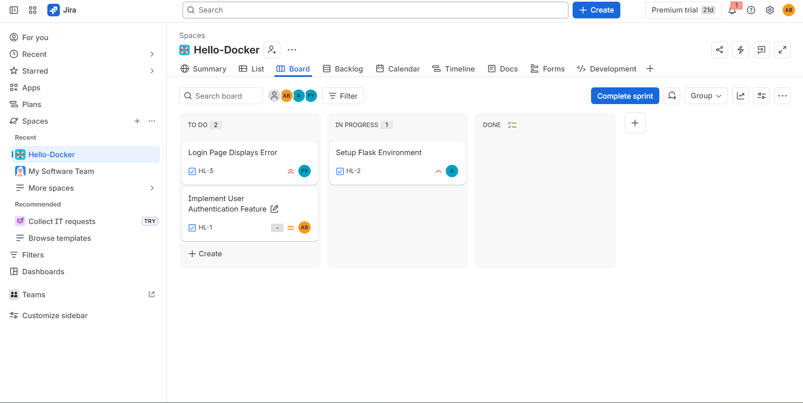
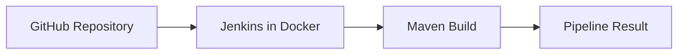
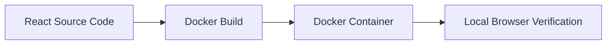
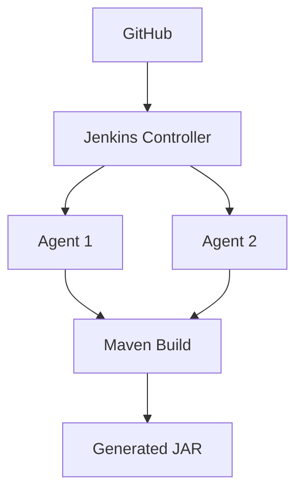

# ADARSH JHA (23070122261) 


## Student Information

- **Name:** Adarsh Jha
- **Course:** DevOps Laboratory
- **Branch: ** CSE 
- **PRN:** 23070122261

## Table of Contents

- [Repository Structure](#repository-structure)
- [Assignments](#assignments)
- [Projects](#projects)
- [Technologies Used](#technologies-used)
- [Learning Outcomes](#learning-outcomes)
- [Conclusion](#conclusion)
- [Author](#author)

## Repository Structure

```text
DevOps-Lab-Assignments/
├── Assignment-TW1.1-Git
├── Assignment-TW1.2-Jira
├── Assignment-TW1.3Docker-Jenkins
├── Project-1-Dockerizing-Jenkins-Pipeline
├── Project-2-React-Docker
├── Project-Distributed-Jenkins
└── README.md
```



## Assignments

### Assignment TW1.1 - Git Workflow & Collaboration

**Objective**

Practice Git fundamentals including branching, collaboration, merge conflict handling, and repository synchronization with GitHub.

**Features**

- Repository initialization and remote connection
- Branch creation and collaboration workflow
- File modifications and commits
- Merge conflict demonstration and resolution

**Workflow**



<details>
<summary><b>📸 Execution Screenshots (Click to Expand)</b></summary>

#### Conflict resolved after merge review


#### Conflict created during collaboration


#### Merge conflict detected in the branch


#### Initial Git workflow verification


#### Branch created and tracked on GitHub


#### Local Docker environment used during validation


#### File modification committed for collaboration


</details>

### Assignment TW1.2 - Jira Project & Issue Tracking

**Objective**

Create and manage a Jira project to organize tasks, track issues, and manage workflow progress.

**Features**

- Jira project setup
- Issue creation and assignment
- Workflow management
- Task tracking and progress visibility

<details>
<summary><b>📸 Execution Screenshots (Click to Expand)</b></summary>

#### Jira dashboard overview


#### Jira issue tracking view


</details>

### Assignment TW1.3 - Docker & Jenkins Freestyle Project

**Objective**

Containerize an application with Docker and automate the build process through a Jenkins Freestyle job.

**Features**

- Docker installation and initialization
- Docker image build and container execution
- Jenkins installation and freestyle job configuration
- Build success verification

<details>
<summary><b>📸 Execution Screenshots (Click to Expand)</b></summary>

#### Docker engine initialization


#### Docker environment setup


#### Docker image build process


#### Docker container run output


#### Local application available on Docker host


#### Jenkins freestyle job configuration


#### Jenkins build confirmation


#### Main branch push after successful delivery


</details>

## Projects

### Project 1 - Dockerizing Jenkins Pipeline

**Objective**

Run Jenkins inside Docker and automate Maven-based CI using a pipeline-as-code approach.

**Features**

- Jenkins controller running in Docker
- Pipeline as code with Jenkinsfile
- Maven build automation
- Continuous integration flow



<details>
<summary><b>📸 Execution Screenshots (Click to Expand)</b></summary>

#### Jenkins pipeline started in Docker


#### Pipeline stage progression


#### Build execution and verification


#### Final pipeline completion


</details>

### Project 2 - React Docker Deployment

**Objective**

Containerize and deploy a React application with Docker, then validate the application in a browser.

**Features**

- React application containerization
- Docker image creation and run
- Local deployment verification
- UI validation in the browser



<details>
<summary><b>📸 Execution Screenshots (Click to Expand)</b></summary>

#### React app build and initial container check


#### Application running in the browser


#### Container status and deployment validation


#### Docker runtime verification


#### React UI successfully rendered


#### Final browser confirmation


#### Final application snapshot


</details>

### Project 4 - Distributed Jenkins Pipeline

**Objective**

Execute a distributed Jenkins pipeline using multiple Docker agents to separate build responsibilities.

**Features**

- Jenkins controller and multiple agents
- Distributed Maven build execution
- GitHub integration
- Build artifact generation



<details>
<summary><b>📸 Execution Screenshots (Click to Expand)</b></summary>

#### Jenkins controller and distributed pipeline start


#### Agent allocation and pipeline execution


#### Maven build on distributed agent


#### Build stage progress


#### Intermediate build verification


#### Pipeline running on assigned agent


#### Build log and stage status


#### Agent handoff and pipeline progression


#### Artifact packaging step


#### Successful pipeline execution


#### Post-build validation


#### Build success summary


#### Final distributed build completion


</details>

## Technologies Used

- Git
- GitHub
- Jira
- Docker
- Jenkins
- Maven
- Java
- React
- Node.js

## Learning Outcomes

- Git branching, merging, and collaboration workflows
- Merge conflict resolution in real repository changes
- Jira project planning and issue tracking
- Docker image creation, container runtime, and validation
- Jenkins Freestyle job setup and CI orchestration
- Pipeline-as-code execution with Jenkinsfiles
- Distributed Jenkins builds with multiple agents
- End-to-end CI/CD workflow understanding

## Conclusion

This repository captures the practical outcomes of a DevOps laboratory workflow across Git, Jira, Docker, Jenkins, Maven, Java, and React. The projects demonstrate how source control, issue tracking, containerization, build automation, and distributed CI pipelines work together in a realistic delivery process.

## Author

<div align="center">

**Adarsh Jha**

</div>
