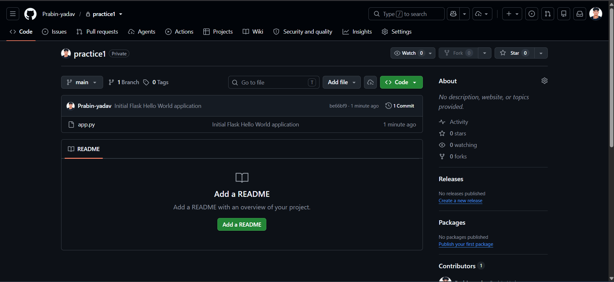

# Git Workflow & Collaboration Assignment

This repository demonstrates a basic Git workflow using a simple Python Flask "Hello World" application. It includes repository initialization, branching, pushing to a remote repository, and resolving merge conflicts.

---

# Assignment Tasks

## Task 1.1: Initialize Git Repository (1 Mark)

- Initialized a new Git repository for the Python Flask "Hello World" application.
- Added the initial application code.
- Committed the code to the `main` branch.

### Screenshot



---

## Task 1.2: Create Feature Branch (1.5 Marks)

- Created a new branch named `feature/user-auth`.
- Modified the application by adding a new print statement.
- Committed the changes.
- Pushed the `feature/user-auth` branch to the remote GitHub repository.

### Screenshots

#### Feature Branch Created


#### Commit on Feature Branch


#### Branch Pushed to GitHub


---

## Task 1.3: Merge Conflict Resolution (1.5 Marks)

- Switched back to the `main` branch.
- Modified the same line that was changed in the feature branch.
- Committed the changes.
- Attempted to merge `feature/user-auth` into `main`.
- Encountered a merge conflict.
- Resolved the conflict manually.
- Committed the resolved changes.
- Pushed the updated `main` branch to GitHub.

### Screenshots

#### Changes on Main Branch


#### Merge Conflict


#### Conflict Resolved


#### Updated Main Branch


---

# Project Structure

```text
.
├── app.py
├── README.md
├── requirements.txt
├── Dockerfile
└── screenshots/
    ├── task1.1-initial-commit.png
    ├── task1.2-feature-branch.png
    ├── task1.2-feature-commit.png
    ├── task1.2-push.png
    ├── task1.3-main-change.png
    ├── task1.3-conflict.png
    ├── task1.3-resolved.png
    └── task1.3-final-push.png
```

---

# Technologies Used

- Python 3
- Flask
- Git
- GitHub

---

# Author

**Prabin Yadav**
