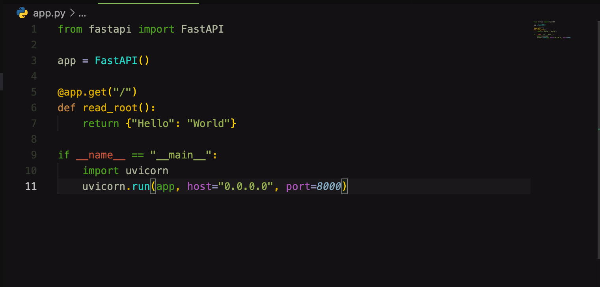
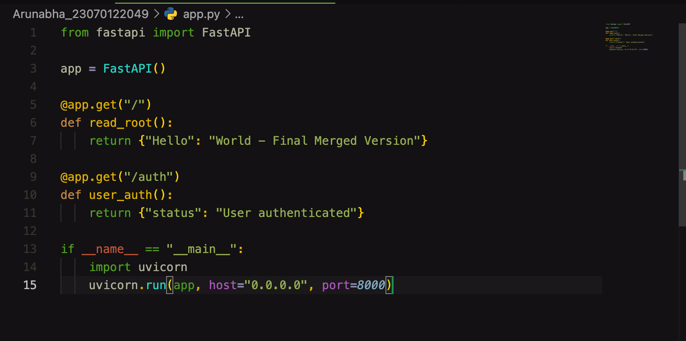

# DevOps Lab L1 - Git Workflow & Collaboration

This repository contains the setup and execution steps for the DevOps Lab Assignment TW1.1. The exercise demonstrates fundamental Git operations, including branching, committing, pushing, and resolving merge conflicts.

## 👤 Student Information

- **Name:** Arunabha Mukhopadhyay
- **PRN:** 23070122049

## 🛠️ Phase 1: Setup Your Fork, Branch, and Folder

### Step 1: Clone Your Forked Repository

Open your terminal and clone the repository from your personal GitHub account.

```bash
git clone https://github.com/Arunabha-Mukhopadhyay/Devops-Lab-L1_2023-27.git
cd Devops-Lab-L1_2023-27
```

### Step 2: Create Your Main Assignment Branch

Create a dedicated main branch for all your projects using your name and PRN.

```bash
git checkout -b Arunabha_23070122049
```

### Step 3: Create Your Dedicated Folder

Create a single folder where all your assignments will live, and navigate into it.

```bash
mkdir Arunabha_23070122049
cd Arunabha_23070122049
```

⚠️ **Important Note:** Since you are already inside a Git repository, do NOT run `git init` inside your new folder. This will create a broken submodule. Simply create the files and let the parent repository track them.

## 🚀 Phase 2: Executing Assignment TW1.1

### Task 1.1: Add Initial Code and Commit

Inside your dedicated folder, create a simple FastAPI file and commit it to your personal branch.

```bash
# Create the initial app.py file
cat > app.py << 'EOF'
from fastapi import FastAPI

app = FastAPI()

@app.get("/")
def read_root():
    return {"Hello": "World"}

if __name__ == "__main__":
    import uvicorn
    uvicorn.run(app, host="0.0.0.0", port=8000)
EOF

# Stage and commit
git add app.py
git commit -m "TW1.1: Add initial FastAPI app"
```

### Task 1.2: Create a Feature Branch and Modify

Create a new feature branch, modify the code to simulate adding user authentication, and push the branch.

```bash
# Create and switch to feature branch
git checkout -b feature/user-auth

# Modify app.py to add an auth endpoint
cat > app.py << 'EOF'
from fastapi import FastAPI

app = FastAPI()

@app.get("/")
def read_root():
    return {"Hello": "World - Feature User Auth Added"}

@app.get("/auth")
def user_auth():
    return {"status": "User authenticated"}

if __name__ == "__main__":
    import uvicorn
    uvicorn.run(app, host="0.0.0.0", port=8000)
EOF

# Stage, commit, and push
git add app.py
git commit -m "TW1.2: Add user auth endpoint"
git push -u origin feature/user-auth
```

### Task 1.3: Simulate and Resolve a Conflict

Switch back to your main assignment branch and modify the same line to trigger a merge conflict deliberately.

```bash
# Switch back to the main assignment branch
git checkout Arunabha_23070122049

# Modify app.py to create a conflict
cat > app.py << 'EOF'
from fastapi import FastAPI

app = FastAPI()

@app.get("/")
def read_root():
    return {"Hello": "World - Main Branch Modification"}

if __name__ == "__main__":
    import uvicorn
    uvicorn.run(app, host="0.0.0.0", port=8000)
EOF

# Commit the change
git add app.py
git commit -m "TW1.3: Modify app.py on main branch to trigger conflict"

# Attempt to merge the feature branch
git merge feature/user-auth
```

## 🔧 Resolving the Merge Conflict

Git will output a `CONFLICT (content)` message. To resolve it:

1. Open `app.py` in your preferred text editor.
2. Locate the conflict markers (`<<<<<<< HEAD`, `=======`, `>>>>>>> feature/user-auth`).
3. Delete the markers and edit the code to reflect how the final version should look, combining both changes.
4. Save the file.

Final resolved version:

```python
from fastapi import FastAPI

app = FastAPI()

@app.get("/")
def read_root():
    return {"Hello": "World - Final Merged Version"}

@app.get("/auth")
def user_auth():
    return {"status": "User authenticated"}

if __name__ == "__main__":
    import uvicorn
    uvicorn.run(app, host="0.0.0.0", port=8000)
```

Once resolved, stage, commit, and push your main branch:

```bash
# Stage the resolved file
git add app.py

# Commit the merge resolution
git commit -m "TW1.3: Resolve merge conflict between main and feature/user-auth"

# Push the final branch to GitHub
git push -u origin Arunabha_23070122049
```

## 📸 Screenshots

### Initial Code (Task 1.1)
The starting `app.py` before any feature or conflict changes.



### Merge Conflict (Task 1.3)
VS Code's merge editor showing the conflict between `HEAD` (main branch) and `feature/user-auth`, with conflict markers visible.


### Resolved Merge (Task 1.3)
The final `app.py` after manually resolving the conflict, combining both the root endpoint update and the new `/auth` endpoint.



## 📌 Summary

This exercise covered:
- Forking and cloning a repository
- Creating and switching between branches
- Making commits to track incremental changes
- Pushing branches to a remote repository
- Deliberately triggering and manually resolving a merge conflict
- Opening a pull request back to the original repository