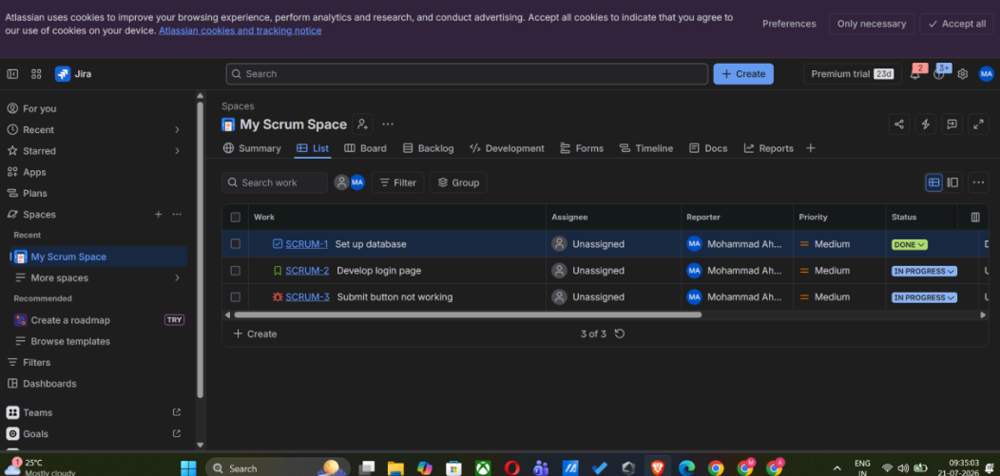
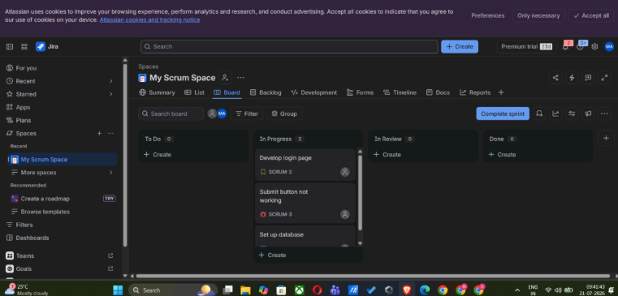
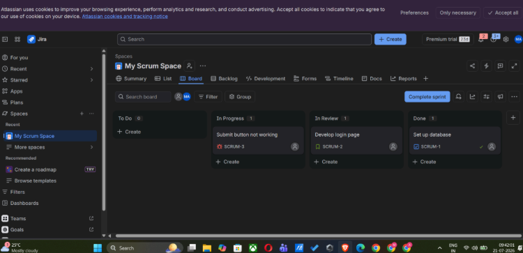

# Assignment TW1.2: Jira Project Setup, Issue Types & Agile Workflow Management

**Student Name:** Mohammad Ahmad  
**PNR:** 23070122140  
**Subject:** DevOps Lab  
**Batch:** 2023-27  

---

## 1. Introduction

Agile project management and issue tracking are essential to modern DevOps pipelines. Tools like Atlassian Jira provide visibility, traceability, and cross-functional team coordination across software development lifecycles. 

This assignment documents the setup of a Jira Scrum project, the definition of distinct issue types (Story, Task, Bug), and the lifecycle movement of work items across the Scrum board (`To Do` → `In Progress` → `Done`).

---

## 2. Objectives

- Set up a Jira Software Cloud/Server project using the **Scrum** framework.
- Configure project metadata (Project Name: `My Scrum Space` / `Hello World Flask`, Project Key: `SCRUM` / `HWF`).
- Create and categorize work items using standardized Agile issue types:
  - **Task**: `SCRUM-1` (*Set up database*)
  - **Story**: `SCRUM-2` (*Develop login page*)
  - **Bug**: `SCRUM-3` (*Submit button not working*)
- Manage sprint backlog planning and issue estimation.
- Simulate workflow status transitions by moving tasks from `To Do` to `In Progress`, `In Review`, and `Done`.
- Document project structure, workflow execution, and screenshots.

---

## 3. Folder Structure

```
Assignment_TW1.2_Jira_Project/
├── README.md               # Jira Scrum project documentation & workflow guide
└── screenshots/            # Verified Jira execution screenshots
    ├── SCREENSHOTS_REQUIRED.md
    ├── TW1.2_01_jira_backlog_all_issues.png
    ├── TW1.2_02_scrum_board_done.png
    └── TW1.2_03_scrum_board_in_progress.png
```

---

## 4. Prerequisites

- **Jira Software Account** (Cloud or Server access)
- **Web Browser** (Chrome, Firefox, Edge)
- Basic understanding of Agile/Scrum concepts (Sprint, Backlog, Story, Task, Bug)

---

## 5. Installation

1. Log into your Atlassian Jira instance: `https://mohammad-ahmad-devops.atlassian.net`.
2. Click **Projects** -> **Create Project**.
3. Select template: **Scrum** software development template.
4. Set project details:
   - **Project Name:** My Scrum Space / Hello World Flask
   - **Project Key:** `SCRUM` / `HWF`
   - **Project Lead:** Mohammad Ahmad (`23070122140`)

---

## 6. Commands

Although Jira is primarily managed through an interactive UI/REST API, integration with Git/GitHub is maintained using Jira smart commits in commit messages:

| Action | Git Commit Message Pattern | Jira Effect |
| :--- | :--- | :--- |
| **Reference Issue** | `git commit -m "SCRUM-1: Set up database configuration"` | Links commit directly to Jira issue `SCRUM-1`. |
| **Transition Issue** | `git commit -m "SCRUM-2 #in-progress: Develop login page"` | Automatically moves `SCRUM-2` to `In Progress`. |
| **Close Issue** | `git commit -m "SCRUM-1 #done: Complete database setup"` | Automatically moves `SCRUM-1` to `Done`. |

---

## 7. Expected Output

At the conclusion of the sprint transition exercise, the Jira Scrum board displays:
- **TO DO Column**: Cleaned / empty as tasks transition into active sprint.
- **IN PROGRESS Column**: `SCRUM-3` (Bug: Submit button not working).
- **IN REVIEW Column**: `SCRUM-2` (Story: Develop login page).
- **DONE Column**: `SCRUM-1` (Task: Set up database).

---

## 8. Explanation

### Agile Issue Types Created:

1. **Task (`SCRUM-1`)**:
   - **Summary:** Set up database
   - **Type:** Task 📘
   - **Status:** Done ✅
   - **Reporter:** Mohammad Ahmad (`23070122140`)

2. **User Story (`SCRUM-2`)**:
   - **Summary:** Develop login page
   - **Type:** Story 📗
   - **Status:** In Review 🔍
   - **Reporter:** Mohammad Ahmad (`23070122140`)

3. **Bug Defect (`SCRUM-3`)**:
   - **Summary:** Submit button not working
   - **Type:** Bug 🔴
   - **Status:** In Progress ⚙️
   - **Reporter:** Mohammad Ahmad (`23070122140`)

### Workflow Transition Path:
```
+---------------+      Drag & Drop      +-----------------+      Drag & Drop      +--------------+
|     TO DO     | -------------------> |   IN PROGRESS   | -------------------> |     DONE     |
+---------------+                       +-----------------+                       +--------------+
  (Created)                               (SCRUM-2, SCRUM-3)                       (SCRUM-1)
```

---

## 9. Screenshots Section

All verified execution proofs are cataloged in [SCREENSHOTS_REQUIRED.md](./screenshots/SCREENSHOTS_REQUIRED.md).

### Verified Execution Screenshots:

#### 1. Jira Issues & Backlog List View

*Figure 1: Jira List view showing all created issues (`SCRUM-1` Task, `SCRUM-2` Story, `SCRUM-3` Bug) with assignee, priority, status, and reporter (Mohammad Ahmad).*

#### 2. Scrum Board - Active Sprint & In-Progress Tasks

*Figure 2: Active Scrum Board view showing work items assigned to `In Progress` column during active sprint execution.*

#### 3. Scrum Board - Task Transition to Done

*Figure 3: Scrum Board view showing completed Task (`SCRUM-1 Set up database`) moved to `DONE`, with `SCRUM-2` in `In Review` and `SCRUM-3` in `In Progress`.*

---

## 10. Conclusion

This assignment highlights the role of Jira in structured Agile software development. By configuring a Scrum board, creating distinct Stories, Tasks, and Bugs under reporter Mohammad Ahmad, and managing transitions from `To Do` to `In Progress` and `Done`, key DevOps traceability and team workflow competencies are demonstrated.
