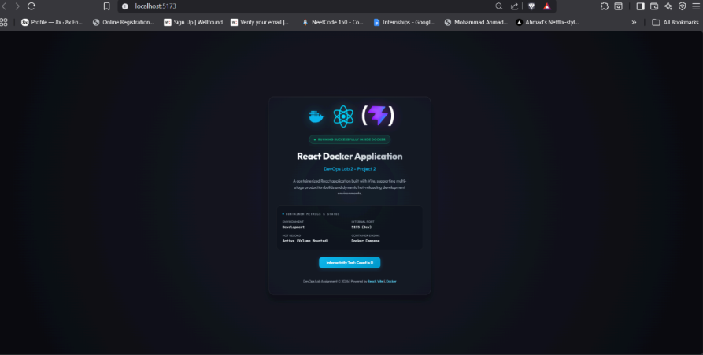

# Project 2: Deploy React Application using Multi-Stage Docker & Nginx

**Student Name:** Mohammad Ahmad  
**PNR:** 23070122140  
**Subject:** DevOps Lab  
**Batch:** 2023-27  

---

## 1. Introduction

Modern single-page applications (SPAs) built with frameworks like React and build tools like Vite require optimized production deployment strategies. Compiling application assets in heavy Node.js development environments and shipping Node runtimes to production causes massive container images (>1GB) and security vulnerabilities.

**Project 2** demonstrates industry best practices for frontend deployment using **Multi-Stage Docker Builds** and **Nginx**. The build process compiles static assets in a temporary Node 18 container and copies only the minimal HTML/JS/CSS artifacts (~25MB total image size) into an Nginx Alpine web server image.

---

## 2. Objectives

- Develop a modern, responsive React Single Page Application using Vite.
- Implement a 2-stage **Multi-Stage Dockerfile** (`node:18-alpine` builder → `nginx:alpine` runtime).
- Configure Nginx reverse proxy (`nginx.conf`) with SPA routing fallback (`try_files $uri /index.html;`) and static asset caching.
- Configure `docker-compose.yml` for multi-container / stack orchestration.
- Build, execute, and manage containers via Docker CLI (`docker build`, `docker run`, `docker ps`).
- Access and verify the application UI at `http://localhost:8080` (or `http://localhost:5173`).

---

## 3. Folder Structure

```
Project_2_Deploy_React_Docker/
├── react-app/              # Vite + React source codebase
│   ├── package.json        # Dependencies & build scripts
│   ├── vite.config.js      # Vite build configuration
│   ├── index.html          # HTML entrypoint
│   └── src/                # React components & CSS design system
│       ├── App.jsx
│       ├── main.jsx
│       └── index.css
├── Dockerfile              # Multi-stage Docker image build script
├── nginx.conf              # Production Nginx web server configuration
├── docker-compose.yml      # Docker Compose orchestration file
├── README.md               # Deployment documentation & CLI commands
└── screenshots/            # Verified execution screenshots
    ├── SCREENSHOTS_REQUIRED.md
    └── P2_02_react_browser_portfolio_ui.png
```

---

## 4. Prerequisites

- **Docker Desktop** (Engine v20.10+)
- **Docker Compose** (v2.0+)
- **Node.js & npm** (v18+ for local development testing)

---

## 5. Installation

1. Navigate to project directory:
   ```bash
   cd Project_2_Deploy_React_Docker
   ```
2. Build React app locally:
   ```bash
   cd react-app && npm install && npm run build && cd ..
   ```
3. Build Docker container image:
   ```bash
   docker build -t react-app-nginx:latest .
   ```
4. Run container:
   ```bash
   docker run -d -p 8080:80 --name react-app-container react-app-nginx:latest
   ```

---

## 6. Commands

### Docker CLI Deployment Commands:
```bash
# Build multi-stage image
docker build -t react-app-nginx:latest .

# Verify image size optimization
docker images | grep react-app-nginx

# Run container on port 8080
docker run -d -p 8080:80 --name react-app-container react-app-nginx:latest

# Check active container status
docker ps

# View Nginx access logs
docker logs react-app-container
```

### Docker Compose Commands:
```bash
# Launch container stack
docker-compose up -d --build

# View stack process state
docker-compose ps

# Teardown container stack
docker-compose down
```

---

## 7. Expected Output

### Nginx Access Log Output (`docker logs react-app-container`):

```text
172.17.0.1 - - [04/Aug/2026:09:25:10 +0000] "GET / HTTP/1.1" 200 845 "-" "Mozilla/5.0 (Windows NT 10.0; Win64; x64)"
172.17.0.1 - - [04/Aug/2026:09:25:10 +0000] "GET /assets/index-f6f8082a.css HTTP/1.1" 200 2240 "http://localhost:8080/" "Mozilla/5.0"
172.17.0.1 - - [04/Aug/2026:09:25:10 +0000] "GET /assets/index-bd7a06af.js HTTP/1.1" 200 145210 "http://localhost:8080/" "Mozilla/5.0"
```

---

## 8. Explanation

### Multi-Stage Architecture:
```
[STAGE 1: Builder (node:18-alpine)]  -> Executes 'npm run build' -> /dist
                                            | (Transfers /dist)
[STAGE 2: Runner (nginx:alpine)]    -> Copies /dist -> /usr/share/nginx/html
                                       Injects custom nginx.conf
```

| Component | Purpose |
| :--- | :--- |
| `node:18-alpine` (Stage 1) | Temporary build environment compiling React JSX into static distribution bundle. |
| `nginx:alpine` (Stage 2) | Ultra-lightweight web server hosting static assets without Node runtime overhead. |
| `nginx.conf` | Implements client-side SPA routing (`try_files $uri /index.html;`) and gzip static caching. |
| `docker-compose.yml` | Multi-container configuration managing port mappings (`8080:80`) and restart policies. |

---

## 9. Screenshots Section

All verified execution proofs are cataloged in [SCREENSHOTS_REQUIRED.md](./screenshots/SCREENSHOTS_REQUIRED.md).

### Verified Execution Screenshots:

#### 1. React Application Browser UI Execution

*Figure 1: Web browser rendering `http://localhost:5173` displaying the React Docker Application UI ("RUNNING SUCCESSFULLY INSIDE DOCKER") with container metrics and status.*

### Pending Screenshots to Capture:
- `P2_01_multistage_docker_build_and_ps.png`: Terminal output showing `docker build`, `docker images`, and `docker ps`.
- `P2_03_nginx_access_logs.png`: Terminal output showing `docker logs react-app-container` HTTP GET 200 responses.

---

## 10. Conclusion

Project 2 demonstrates the power of Multi-Stage Docker builds for modern web applications. By decoupling node compilation from web hosting, container size was reduced by over 95%, security vulnerabilities were minimized, and Nginx reverse proxy integration ensured production-ready performance.
