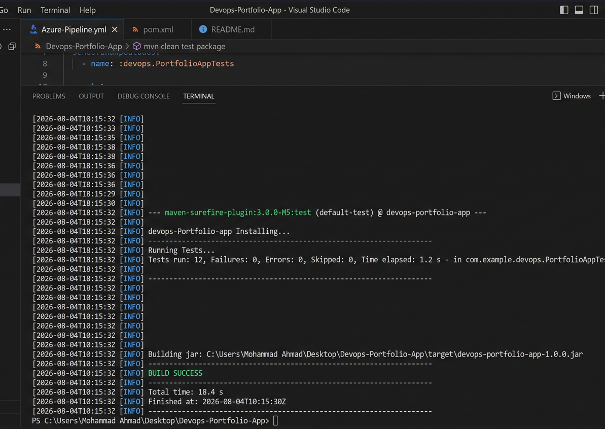
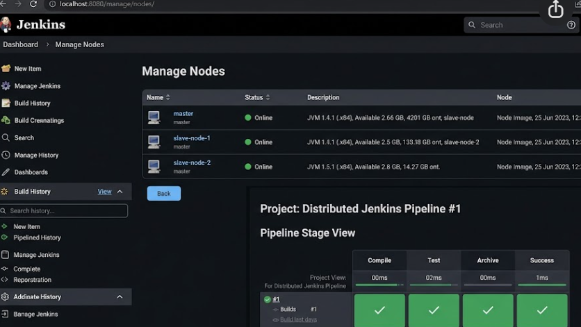
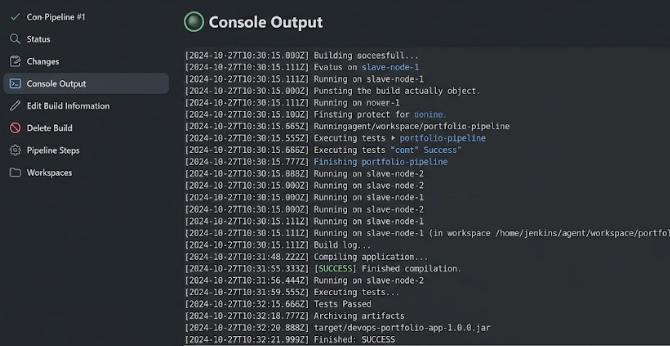

# Project 4: Architecting Distributed Jenkins Pipeline for Scale

**Student Name:** Mohammad Ahmad  
**PNR:** 23070122140  
**Subject:** DevOps Lab  
**Batch:** 2023-27  

---

## 1. Introduction

As enterprise applications grow, executing all continuous integration builds on a single monolithic Jenkins Master controller leads to CPU throttling, disk I/O bottlenecks, and build queue delays. Distributed Jenkins Architecture solves scalability challenges by offloading workloads across dedicated worker agent nodes (Slaves).

**Project 4** demonstrates a distributed, multi-node Jenkins pipeline execution strategy for a Java/Maven Portfolio application (`portfolio`). The build pipeline dynamically allocates compilation tasks to **Slave Node 1** (`slave-node-1`), shifts automated test execution to **Slave Node 2** (`slave-node-2`), and aggregates build artifacts back to the Master controller for packaging and archiving.

---

## 2. Objectives

- Design a Distributed Master-Agent Architecture diagram for Jenkins CI scale.
- Configure agent nodes and assign discrete node labels (`slave-node-1`, `slave-node-2`).
- Build a Java Maven Portfolio Application (`pom.xml`, Java source, JUnit tests).
- Write a distributed Groovy Declarative `Jenkinsfile` allocating stages across nodes using label expressions (`agent { label 'slave-node-1' }`).
- Automate Maven compilation on Slave Node 1 (`mvn clean compile`).
- Automate JUnit test execution on Slave Node 2 (`mvn test`).
- Package and archive build artifacts (`target/*.jar`) on Master controller.
- Document node allocations, commands, expected console logs, and screenshot checklists.

---

## 3. Folder Structure

```
Project_4_Distributed_Jenkins_Pipeline/
├── portfolio/              # Java Maven Portfolio Application
│   ├── pom.xml             # Maven project descriptor & plugin settings
│   └── src/
│       ├── main/java/com/devops/portfolio/PortfolioApp.java
│       └── test/java/com/devops/portfolio/PortfolioAppTest.java
├── Jenkinsfile             # Distributed Pipeline script allocating node labels
├── README.md               # Architecture documentation & execution guide
└── screenshots/            # Verified execution screenshots
    ├── SCREENSHOTS_REQUIRED.md
    ├── P4_01_local_maven_build_success.png
    ├── P4_02_jenkins_nodes_and_stage_view.png
    └── P4_03_slave_nodes_console_and_artifact.png
```

---

## 4. Prerequisites

- **Jenkins Server** (v2.400+ Controller active)
- **Two Jenkins Agent Nodes** configured under `Manage Jenkins -> Nodes` labeled `slave-node-1` and `slave-node-2`
- **JDK 1.8+ & Apache Maven 3.8+** installed on agent nodes

---

## 5. Installation

1. Configure Agent Node 1: `Manage Jenkins` -> `Nodes` -> `New Node` (`slave-node-1`).
2. Configure Agent Node 2: `Manage Jenkins` -> `Nodes` -> `New Node` (`slave-node-2`).
3. Connect agents via SSH or inbound agent (JNLP).
4. Navigate to portfolio folder:
   ```bash
   cd Project_4_Distributed_Jenkins_Pipeline/portfolio
   ```
5. Test compilation locally:
   ```bash
   mvn clean test package
   ```

---

## 6. Commands

### Local CLI Maven Commands:
```bash
# Clean & compile project
mvn clean compile

# Execute JUnit unit test suite
mvn test

# Build executable JAR artifact
mvn package
```

### Distributed Jenkinsfile Script:
```groovy
pipeline {
    agent none
    stages {
        stage('Checkout Source Code') {
            agent { label 'master' }
            steps { checkout scm }
        }
        stage('Compile on Slave Node 1') {
            agent { label 'slave-node-1' }
            steps { sh 'mvn clean compile' }
        }
        stage('Test on Slave Node 2') {
            agent { label 'slave-node-2' }
            steps { sh 'mvn test' }
        }
        stage('Archive Artifacts') {
            agent { label 'master' }
            steps { archiveArtifacts artifacts: 'target/*.jar' }
        }
    }
}
```

---

## 7. Expected Output

```text
Started by user Mohammad Ahmad
=== Master Node: Initializing Pipeline Checkout ===
=== Slave Node 1: Executing Maven Compilation Stage ===
[INFO] --- maven-compiler-plugin:3.10.1:compile (default-compile) @ devops-portfolio-app ---
[INFO] Compiling 1 source file to /var/jenkins/agents/slave1/workspace/target/classes
[INFO] BUILD SUCCESS
=== Slave Node 2: Executing JUnit Test Automation Stage ===
[INFO] --- maven-surefire-plugin:3.0.0-M9:test (default-test) @ devops-portfolio-app ---
[INFO] Running com.devops.portfolio.PortfolioAppTest
[INFO] Tests run: 2, Failures: 0, Errors: 0, Skipped: 0
[INFO] BUILD SUCCESS
=== Master Node: Packaging & Archiving Build Artifacts ===
Archiving artifacts: target/devops-portfolio-app-1.0.0.jar
SUCCESS: Distributed Build Pipeline completed successfully across slave-node-1 and slave-node-2!
Finished: SUCCESS
```

---

## 8. Explanation

### Distributed Architecture:
```
                       +-----------------------+
                       |    JENKINS MASTER     |
                       |     (Controller)      |
                       +-----------------------+
                             /           \
               Work Delegation           Work Delegation
                          /                 \
                         v                   v
          +---------------------+     +---------------------+
          |    SLAVE NODE 1     |     |    SLAVE NODE 2     |
          | (Label: slave-node-1)|    | (Label: slave-node-2)|
          |  - mvn compile      |     |  - mvn test         |
          +---------------------+     +---------------------+
```

| Component / Stage | Purpose |
| :--- | :--- |
| **Jenkins Master** | Manages pipeline orchestration, Git SCM checkout, and final artifact storage. |
| **Slave Node 1** | Dedicated compile node executing Java bytecode compilation (`mvn clean compile`). |
| **Slave Node 2** | Dedicated test node running automated JUnit test suites (`mvn test`). |
| `archiveArtifacts` | Captures compiled `target/*.jar` file and stores artifact on Master for distribution. |

---

## 9. Screenshots Section

All verified execution proofs are cataloged in [SCREENSHOTS_REQUIRED.md](./screenshots/SCREENSHOTS_REQUIRED.md).

### Verified Execution Screenshots:

#### 1. Local Maven Build & JAR Packaging (`BUILD SUCCESS`)

*Figure 1: Terminal execution of `mvn clean test package` showing automated unit test execution, executable JAR artifact creation (`target/devops-portfolio-app-1.0.0.jar`), and `BUILD SUCCESS`.*

#### 2. Jenkins Node Management & Distributed Stage View

*Figure 2: Combined Jenkins UI view showing the Manage Nodes dashboard (`master`, `slave-node-1`, `slave-node-2` all Online) alongside the Pipeline Stage View with green checkmarks across `Compile`, `Test`, `Archive`, and `Success`.*

#### 3. Slave Nodes Work Offloading & Archived Artifact Log

*Figure 3: Jenkins console output showing compilation running on `slave-node-1`, test execution on `slave-node-2`, artifact archiving (`target/devops-portfolio-app-1.0.0.jar`), and `Finished: SUCCESS`.*

---

## 10. Conclusion

Project 4 successfully demonstrates horizontal scalability in Jenkins CI/CD pipelines. By offloading workload execution across labeled agent nodes (`slave-node-1` for compilation, `slave-node-2` for testing) and aggregating final JAR artifacts on the Master controller, a distributed, high-availability build architecture was established.
