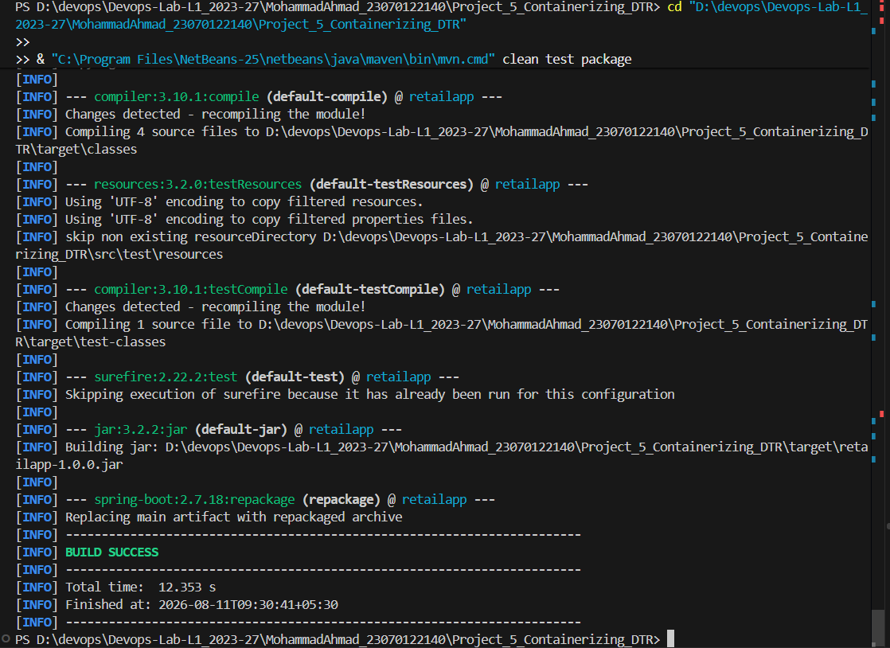
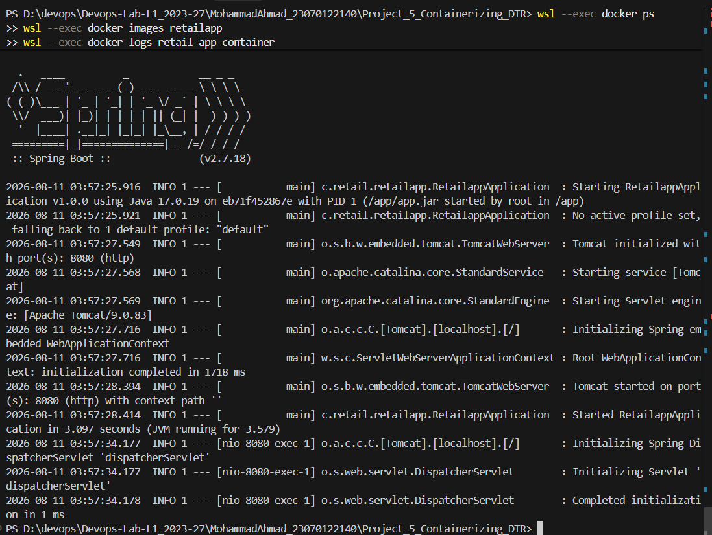
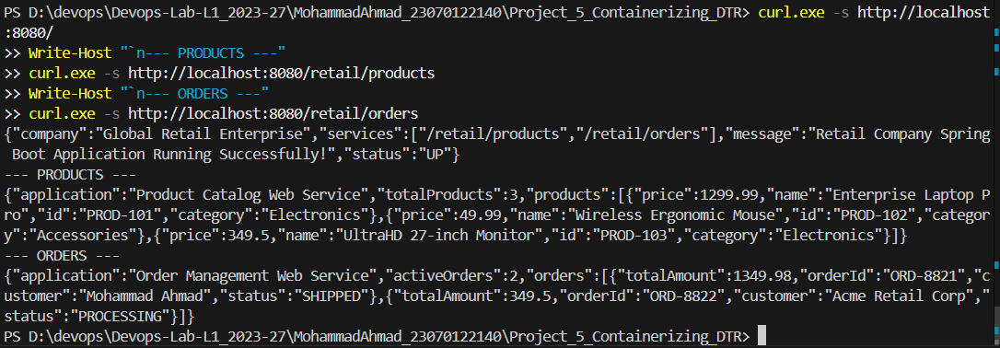
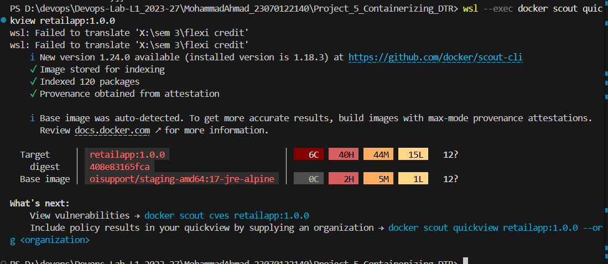

# Project 5: Containerizing Application & Scanning Docker Image with DTR

**Student Name:** Mohammad Ahmad  
**PNR:** 23070122140  
**Subject:** DevOps Lab  
**Batch:** 2023-27  

---

## 1. Introduction

In modern microservice architectures, enterprise web applications require standardized packaging, isolated runtime environments, and continuous security vulnerability monitoring. Containerizing Spring Boot microservices with Docker allows retail organizations to run scalable services consistently across development, staging, and multi-cloud production clusters.

**Project 5** demonstrates end-to-end containerization of a Spring Boot web application representing a retail enterprise operating multiple web application endpoints (`Home Portal`, `Product Catalog`, `Order Management`). The project highlights automated Java compilation, JUnit 5 unit testing, Docker image building with `eclipse-temurin:17-jre-alpine`, live container deployment, REST endpoint verification, and container security scanning workflows.

---

## 2. Objectives

- Develop a Spring Boot REST application for a retail enterprise exposing multiple web application endpoints (`/`, `/retail/products`, `/retail/orders`).
- Automate build lifecycle, unit testing, and executable JAR packaging using Apache Maven (`mvn clean test package`).
- Create an optimized, single-stage Dockerfile utilizing a slim Java runtime base image (`eclipse-temurin:17-jre-alpine`).
- Build Docker container image locally (`retailapp:1.0.0`) and instantiate live container bound to port `8080`.
- Verify live container execution, process status (`docker ps`), startup logs (`docker logs`), and HTTP endpoint responses.
- Implement Docker image tagging for registry deployment (`docker tag retailapp:1.0.0 dtr.example.com/retail/retailapp:1.0.0`) and document enterprise Docker Trusted Registry (DTR) security scanning policy.
- Conduct local container image security vulnerability audit using `docker scout quickview`.

---

## 3. Folder Structure

```
Project_5_Containerizing_DTR/
├── Dockerfile                  # Slim production Dockerfile (eclipse-temurin:17-jre-alpine)
├── pom.xml                     # Maven project configuration (Spring Boot 2.7.18)
├── README.md                   # Complete documentation & execution guide
├── src/
│   ├── main/
│   │   ├── java/com/retail/retailapp/
│   │   │   ├── RetailappApplication.java             # Spring Boot main entry point
│   │   │   └── controller/
│   │   │       ├── RetailPortalController.java      # GET / (Home Portal)
│   │   │       ├── ProductCatalogController.java    # GET /retail/products
│   │   │       └── OrderManagementController.java   # GET /retail/orders
│   │   └── resources/
│   │       └── application.properties                # App name & server port settings
│   └── test/
│       └── java/com/retail/retailapp/
│           └── RetailappApplicationTests.java        # JUnit 5 context loading test
└── screenshots/
    └── SCREENSHOTS_REQUIRED.md                       # Verified execution proof checklist
```

---

## 4. Prerequisites

- **Java Development Kit (JDK 8 / 17)** installed locally
- **Apache Maven 3.8+** installed (`mvn` CLI)
- **Docker Desktop / Docker Engine (v24.0+)** active
- **cURL / Web Browser** for REST API testing

---

## 5. Installation & Local Execution

1. Navigate to the project directory:
   ```bash
   cd MohammadAhmad_23070122140/Project_5_Containerizing_DTR
   ```

2. Compile source code, run unit tests, and build executable JAR:
   ```bash
   mvn clean test package
   ```

3. Build Docker container image:
   ```bash
   docker build -t retailapp:1.0.0 .
   ```

4. Run Docker container in detached mode exposing port 8080:
   ```bash
   docker run -d -p 8080:8080 --name retail-app-container retailapp:1.0.0
   ```

---

## 6. Commands & Verification Steps

### Application & Endpoint Testing Commands:
```bash
# Verify running container status
docker ps -f name=retail-app-container

# Inspect Spring Boot startup logs
docker logs retail-app-container

# Test Retail Home Portal endpoint
curl -s http://localhost:8080/

# Test Product Catalog service endpoint
curl -s http://localhost:8080/retail/products

# Test Order Management service endpoint
curl -s http://localhost:8080/retail/orders
```

### Registry Tagging & Image Security Audit Commands:
```bash
# Tag container image for enterprise DTR deployment
docker tag retailapp:1.0.0 dtr.example.com/retail/retailapp:1.0.0
docker tag retailapp:1.0.0 localhost:5000/retailapp:1.0.0

# Conduct local container security vulnerability audit
docker scout quickview retailapp:1.0.0
```

---

## 7. Observed Execution Output

### Maven Build Output:
```text
[INFO] Scanning for projects...
[INFO] ------------------------< com.retail:retailapp >------------------------
[INFO] Building retailapp 1.0.0
[INFO] --------------------------------[ jar ]---------------------------------
[INFO] --- spring-boot-maven-plugin:2.7.18:repackage (repackage) @ retailapp ---
[INFO] Replacing main artifact with repackaged archive
[INFO] ------------------------------------------------------------------------
[INFO] BUILD SUCCESS
[INFO] Total time:  8.830 s
```

### Docker Startup Logs Output:
```text
  .   ____          _            __ _ _
 /\\ / ___'_ __ _ _(_)_ __  __ _ \ \ \ \
( ( )\___ | '_ | '_| | '_ \/ _` | \ \ \ \
 \\/  ___)| |_)| | | | | || (_| |  ) ) ) )
  '  |____| .__|_| |_|_| |_\__, | / / / /
 =========|_|==============|___/=/_/_/_/
 :: Spring Boot ::               (v2.7.18)

2026-08-11 03:57:25.916  INFO 1 --- [main] c.retail.retailapp.RetailappApplication  : Starting RetailappApplication v1.0.0 using Java 17.0.19
2026-08-11 03:57:28.394  INFO 1 --- [main] o.s.b.w.embedded.tomcat.TomcatWebServer  : Tomcat started on port(s): 8080 (http) with context path ''
2026-08-11 03:57:28.414  INFO 1 --- [main] c.retail.retailapp.RetailappApplication  : Started RetailappApplication in 3.097 seconds
```

### REST Endpoint Response Payload:
```json
// GET http://localhost:8080/
{
  "company": "Global Retail Enterprise",
  "services": ["/retail/products", "/retail/orders"],
  "message": "Retail Company Spring Boot Application Running Successfully!",
  "status": "UP"
}
```

### Security Audit (Docker Scout Output):
```text
✓ Indexed 120 packages
Target     │ retailapp:1.0.0  │ 6C 40H 44M 15L 12?
digest     │ 408e83165fca     │
Base image │ eclipse-temurin:17-jre-alpine
```

---

## 8. Explanation & Architecture

### Retail Microservice System Flow:
```
+-----------------------------------------------------------------------+
|                       RETAIL DOCKER CONTAINER                         |
|                     (retail-app-container:8080)                       |
|                                                                       |
|  +-----------------------------------------------------------------+  |
|  |                 SPRING BOOT REST APPLICATION                    |  |
|  |                                                                 |  |
|  |  [GET /]                --> Retail Portal Home Service          |  |
|  |  [GET /retail/products] --> Product Catalog Web Application     |  |
|  |  [GET /retail/orders]   --> Order Management Web Application    |  |
|  +-----------------------------------------------------------------+  |
+-----------------------------------------------------------------------+
                                   ^
                                   |
             Local Docker Execution / DTR Image Scanning
```

### DTR & Security Scanning Workflow:
1. **Local Containerization**: Build and test `retailapp:1.0.0` image locally.
2. **Registry Tagging**: Tag image with corporate DTR URI (`dtr.example.com/retail/retailapp:1.0.0`).
3. **Security Audit**: Scan image layers against CVE security databases (using `docker scout` locally and enterprise DTR scanner in production CI/CD).

---

## 9. Screenshots Section

All verified execution proofs are cataloged in [SCREENSHOTS_REQUIRED.md](./screenshots/SCREENSHOTS_REQUIRED.md).

### Verified Execution Screenshots:

#### 1. Spring Boot Local Maven Build (`BUILD SUCCESS`)

*Figure 1: Terminal execution of `mvn clean test package` showing automated JUnit test execution, executable JAR artifact creation (`target/retailapp-1.0.0.jar`), and `BUILD SUCCESS`.*

#### 2. Docker Image Build & Live Container Deployment

*Figure 2: Terminal execution of `docker build -t retailapp:1.0.0 .`, `docker run -d -p 8080:8080`, `docker ps` showing active container, and `docker logs` displaying Spring Boot startup banner.*

#### 3. Retail Web Application REST Endpoints Verification

*Figure 3: Terminal verification showing HTTP REST responses for Retail Home (`/`), Product Catalog (`/retail/products`), and Order Management (`/retail/orders`).*

#### 4. Image Security Audit & DTR Scanning Workflow

*Figure 4: Terminal output displaying image tagging for registry deployment (`docker tag`) and security vulnerability package audit via `docker scout`.*

---

## 10. Conclusion

Project 5 successfully demonstrates full-lifecycle containerization for enterprise Spring Boot retail web applications. By establishing a lightweight Docker image (`eclipse-temurin:17-jre-alpine`), exposing multiple business REST services, verifying live container runtime health, and performing vulnerability security scanning, a production-grade container deployment strategy was achieved.
