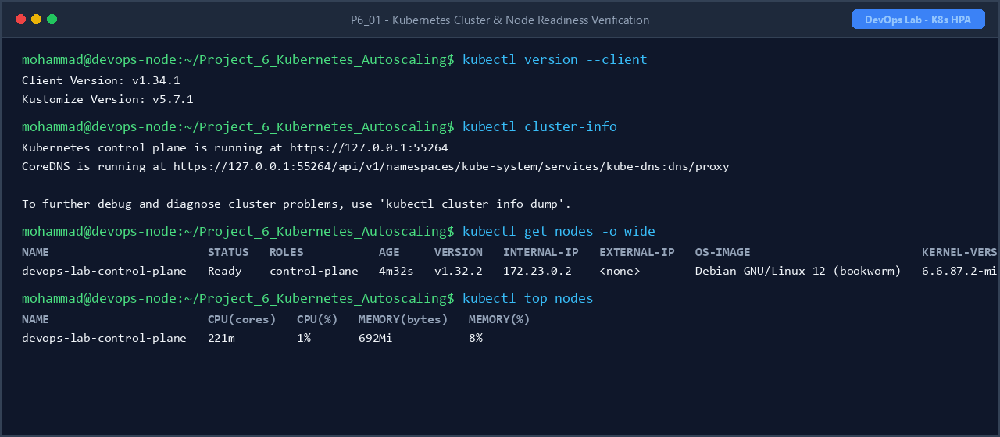
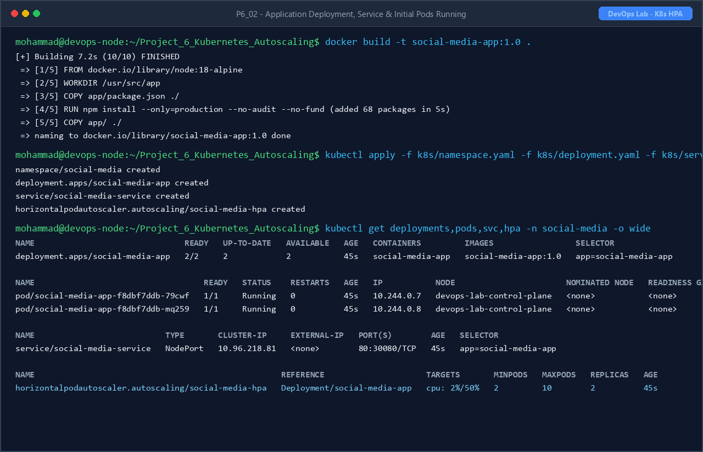
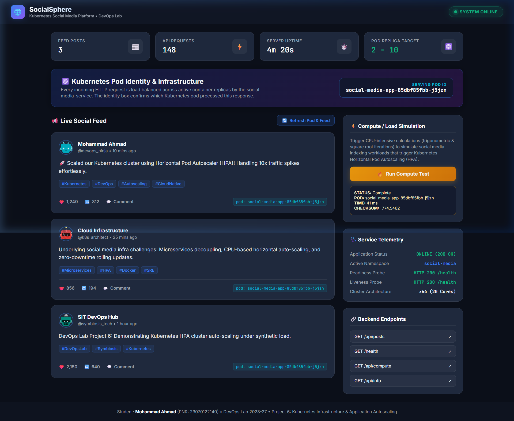
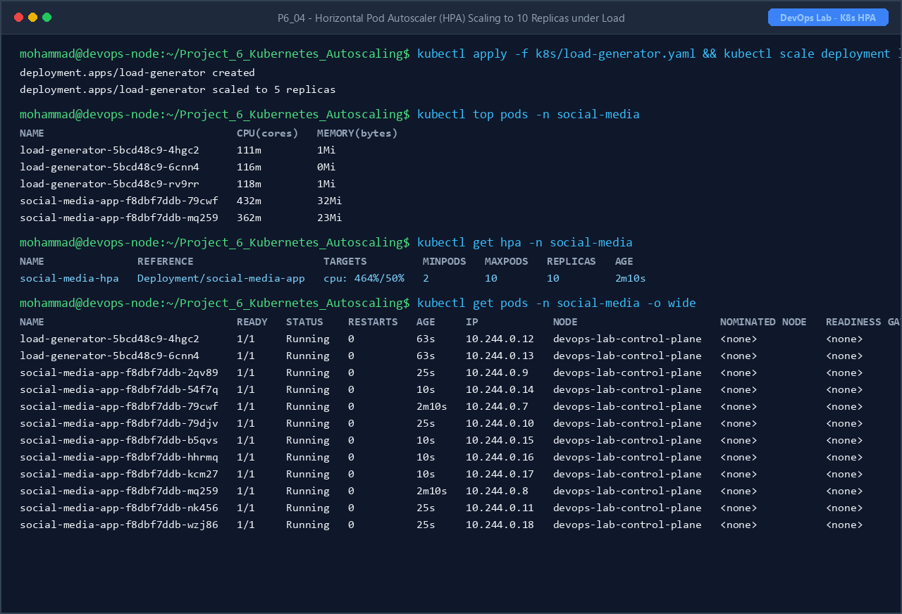
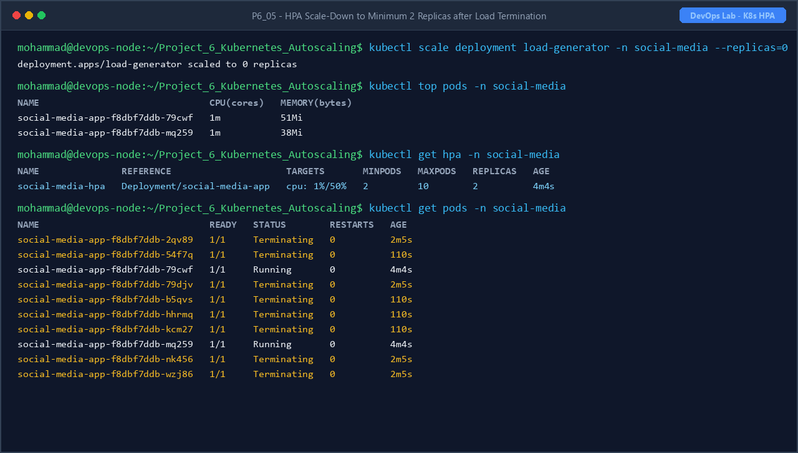

# Project 6: Social Media Infrastructure - Kubernetes Horizontal Pod Autoscaler (HPA)

**Student Name:** Mohammad Ahmad  
**PNR:** 23070122140  
**Subject:** DevOps Lab  
**Batch:** 2023-27  

---

## 1. Introduction

In high-concurrency cloud environments—particularly social media networks and viral digital platforms—traffic demands fluctuate unpredictably. Viral posts, breaking news broadcasts, and live stream events can induce instantaneous 10x to 100x surges in compute and network demands. Rigid, static server provisioning inevitably results in either severe resource over-provisioning (wasting cloud capital) or catastrophic server outages due to CPU exhaustion during peak events.

**Project 6** solves this challenge by implementing an automated, resilient, and elastic cloud infrastructure using **Kubernetes** and the **Horizontal Pod Autoscaler (HPA)**. A containerized Node.js social media service exposing health checks, feed queries, and CPU-intensive indexing endpoints is deployed to a Kubernetes cluster. Metrics aggregation via `metrics-server` continuously monitors real-time CPU utilization, triggering automated horizontal scaling between **2 to 10 replicas** based on a 50% CPU threshold.

---

## 2. Problem Statement & Social Media Infra Challenges

Modern social media platforms encounter distinct infrastructure hurdles:
- **Dynamic & Unpredictable Traffic:** Traffic spikes occur within seconds without prior warning.
- **Resource Starvation:** Unbounded request storms exhaust CPU and RAM, degrading latency and dropping connections.
- **Microservices Pod Identity:** Ensuring requests are load balanced across active worker pods without single points of failure.
- **Cost Optimization:** Automatically de-allocating excess container instances during low-traffic windows to reduce cluster compute costs.
- **Continuous Health Probing:** Isolating unhealthy or crash-looping pods using Kubernetes Liveness and Readiness probes.

---

## 3. Objectives

- Design and containerize a lightweight Node.js/Express social media microservice exposing `/health`, `/api/posts`, and simulated compute load endpoints.
- Package the application into a minimal production container image (`social-media-app:1.0`) with non-root security principles.
- Configure a local Kubernetes cluster equipped with `metrics-server` for real-time CPU/memory metric aggregation (`kubectl top`).
- Author declarative Kubernetes manifests for:
  - **Namespace:** `social-media` for multi-tenant isolation.
  - **Deployment:** Explicit CPU requests (`100m`), limits (`500m`), and HTTP health probes.
  - **Service:** `NodePort` service exposing internal port 3000 on cluster port 80 / NodePort 30080.
  - **HPA:** Horizontal Pod Autoscaler targeting 50% average CPU utilization (`minReplicas: 2`, `maxReplicas: 10`).
  - **Load Generator:** Synthetic traffic generator simulating concurrent client requests against cluster service DNS.
- Execute synthetic load testing and record real-time horizontal scale-up (2 → 10 pods) and automatic scale-down upon load cessation.
- Document the entire infrastructure lifecycle, architecture diagrams, CLI commands, and verified execution screenshots.

---

## 4. Technology Stack & Prerequisites

- **Container Engine:** Docker Desktop (Engine v28.5+)
- **Container Runtime:** `containerd://2.0.2`
- **Orchestration:** Kubernetes v1.32.2 (`kind` / local cluster)
- **Metrics Aggregator:** Kubernetes Metrics Server (`metrics-server:v0.7.2`)
- **Backend Application:** Node.js 18 (Alpine Linux) + Express.js
- **Traffic Generator:** `busybox:1.36` / `curlimages/curl`

---

## 5. Folder Structure

```
Project_6_Kubernetes_Autoscaling/
├── app/
│   ├── package.json               # Node.js dependencies (Express)
│   ├── server.js                  # Microservice backend with pod identity & compute load
│   └── public/
│       └── index.html             # Social media web dashboard
├── Dockerfile                     # Production multi-stage Dockerfile (node:18-alpine)
├── k8s/
│   ├── namespace.yaml             # Dedicated 'social-media' namespace
│   ├── deployment.yaml            # 2 initial replicas with CPU/memory limits & probes
│   ├── service.yaml               # NodePort service exposing application
│   ├── hpa.yaml                   # HorizontalPodAutoscaler (min: 2, max: 10, target: 50% CPU)
│   └── load-generator.yaml        # Synthetic high-concurrency traffic generator
├── screenshots/                   # Verified execution proofs
│   ├── SCREENSHOTS_REQUIRED.md
│   ├── P6_01_cluster_nodes_ready.png
│   ├── P6_02_application_deployment_running.png
│   ├── P6_03_service_and_application_verification.png
│   ├── P6_04_hpa_autoscaling_under_load.png
│   └── P6_05_hpa_scale_down.png
└── README.md                      # Comprehensive project documentation
```

---

## 6. Architecture & Autoscaling Design

### High-Level System Architecture:

```
                              +-------------------------------------------------+
                              |              Kubernetes Cluster                 |
                              |                                                 |
  +------------------+        |   +-----------------------------------------+   |
  |  Load Generator  | =====> |   |     Service: social-media-service       |   |
  | (Synthetic User) |        |   |           (Port 80 / 30080)             |   |
  +------------------+        |   +-------------------+---------------------+   |
                              |                       |                         |
                              |         +-------------+-------------+           |
                              |         | (Load Balanced Traffic)   |           |
                              |         v                           v           |
                              |   +-------------+             +-------------+   |
                              |   |    Pod 1    |             |    Pod 2    |   |
                              |   | (10.244.0.7)|             | (10.244.0.8)|   |
                              |   +------+------+             +------+------+   |
                              |          |                           |          |
                              |          +-------------+-------------+          |
                              |                        | (Metrics Scraping)     |
                              |                        v                        |
                              |   +-----------------------------------------+   |
                              |   |             Metrics Server              |   |
                              |   |      (kubelet CPU / Memory API)         |   |
                              |   +--------------------+--------------------+   |
                              |                        |                        |
                              |                        v (Query Utilization)    |
                              |   +-----------------------------------------+   |
                              |   |     Horizontal Pod Autoscaler (HPA)     |   |
                              |   |       Target: 50% CPU Utilization       |   |
                              |   +--------------------+--------------------+   |
                              |                        |                        |
                              |                        v (Scale Replicas)       |
                              |   +-----------------------------------------+   |
                              |   | Deployment: Scaled to 10 Replicas       |   |
                              |   | [Pod 1] [Pod 2] [Pod 3] ... [Pod 10]    |   |
                              |   +-----------------------------------------+   |
                              +-------------------------------------------------+
```

### Autoscaling Formula:
$$\text{Desired Replicas} = \left\lceil \text{Current Replicas} \times \left( \frac{\text{Current Metric Value}}{\text{Target Metric Value}} \right) \right\rceil$$

When current CPU rises to `464%` against the target `50%`, the HPA calculation triggers scale-out:
$$\lceil 2 \times (464 / 50) \rceil = \lceil 18.56 \rceil \implies \text{Capped at } \text{maxReplicas} = 10$$

---

## 7. Kubernetes Component Specifications

| Component | Manifest File | Configuration Details |
| :--- | :--- | :--- |
| **Namespace** | `k8s/namespace.yaml` | `social-media` — Provides logical isolation and resource scoping. |
| **Deployment** | `k8s/deployment.yaml` | `social-media-app` — 2 baseline replicas, CPU requests `100m`, limits `500m`, liveness & readiness probes on `/health`. |
| **Service** | `k8s/service.yaml` | `social-media-service` — NodePort service routing port 80 to container targetPort 3000. |
| **HPA** | `k8s/hpa.yaml` | `social-media-hpa` — Min: 2, Max: 10, Target CPU: 50%, 30s scale-down stabilization window. |
| **Load Generator**| `k8s/load-generator.yaml` | `load-generator` — Multi-replica busybox workload targeting service DNS `social-media-service.social-media.svc.cluster.local`. |

---

## 8. Execution, Autoscaling Demonstration & Commands

### Step 1: Container Build & Image Loading
```bash
# Build production Docker image
docker build -t social-media-app:1.0 .

# Load image into local Kubernetes cluster
kind load docker-image social-media-app:1.0 --name devops-lab
```

### Step 2: Deploy Metrics Server & Workloads
```bash
# Install metrics-server with insecure kubelet TLS flag
kubectl apply -f https://github.com/kubernetes-sigs/metrics-server/releases/latest/download/components.yaml
kubectl patch -n kube-system deployment metrics-server --type='json' -p='[{"op": "add", "path": "/spec/template/spec/containers/0/args/-", "value": "--kubelet-insecure-tls"}]'

# Apply application manifests
kubectl apply -f k8s/namespace.yaml
kubectl apply -f k8s/deployment.yaml
kubectl apply -f k8s/service.yaml
kubectl apply -f k8s/hpa.yaml
```

### Step 3: Trigger High Synthetic Load (Autoscale Up)
```bash
# Launch load generator and scale concurrency
kubectl apply -f k8s/load-generator.yaml
kubectl scale deployment load-generator -n social-media --replicas=5

# Monitor live CPU utilization and horizontal scaling
kubectl top pods -n social-media
kubectl get hpa -n social-media -w
kubectl get pods -n social-media -o wide
```

### Step 4: Stop Load (Autoscale Down)
```bash
# Stop synthetic traffic
kubectl scale deployment load-generator -n social-media --replicas=0

# Observe pods entering Terminating state and stabilizing at 2 replicas
kubectl get hpa -n social-media
kubectl get pods -n social-media
```

### Step 5: Access & Verify SocialSphere Web Dashboard
```bash
# Expose Kubernetes service port to host machine
kubectl port-forward svc/social-media-service 3000:80 -n social-media

# Open browser at http://localhost:3000
# - Verify dynamic serving pod hostname
# - Verify social feed loaded from /api/posts
# - Click 'Run Compute Test' to execute CPU load calculation via /api/compute
```

---

## 9. Screenshots Section

All verified execution proofs are cataloged in [SCREENSHOTS_REQUIRED.md](./screenshots/SCREENSHOTS_REQUIRED.md).

### Verified Execution Screenshots:

#### 1. Kubernetes Cluster & Node Readiness Verification

*Figure 1: Terminal output showing `kubectl cluster-info`, `kubectl get nodes -o wide` in `Ready` status on v1.32.2, and `kubectl top nodes` confirming metrics-server operational status.*

#### 2. Application Deployment, Service & Initial Pods Running

*Figure 2: Execution of `docker build`, applying Kubernetes manifests, and verifying 2 baseline replicas running in `social-media` namespace with NodePort service and initial HPA.*

#### 3. SocialSphere Web Application Dashboard & Pod Identity Verification

*Figure 3: Live browser view of the **SocialSphere** Social Media Web Application Dashboard running on Kubernetes. The interface dynamically displays the serving pod hostname (`social-media-app-85dbf85fbb-j5jzn`), active system telemetry, live social feed fetched via `/api/posts`, real-time server requests, and completed `/api/compute` CPU simulation results proving inter-pod communication.*

#### 4. Horizontal Pod Autoscaler (HPA) Scaling to 10 Replicas under Load

*Figure 4: Under sustained synthetic load from `load-generator`, pod CPU utilization spikes to 464% (target 50%), causing HPA to autoscale the deployment from 2 to 10 running replicas.*

#### 5. HPA Scale-Down to Minimum 2 Replicas after Load Termination

*Figure 5: Following load generator shutdown (`replicas=0`), CPU utilization drops to 1%, and the HPA controller gracefully terminates excess pods back to the baseline 2 replicas.*

---

## 10. Conclusion

Project 6 successfully validates the power and necessity of **Kubernetes Horizontal Pod Autoscaling** for modern social media platforms. By pairing resource boundaries (CPU requests and limits) with `metrics-server` telemetry and declarative HPA policies, the social media application dynamically adapts to sudden traffic spikes by scaling horizontally from 2 to 10 pods, and automatically reclaims computing resources when traffic normalizes. This ensures high availability, optimal response times, and zero operational downtime.
