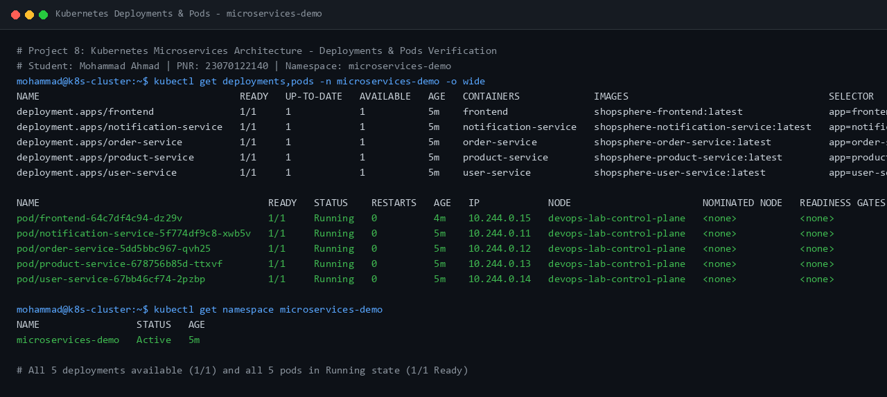
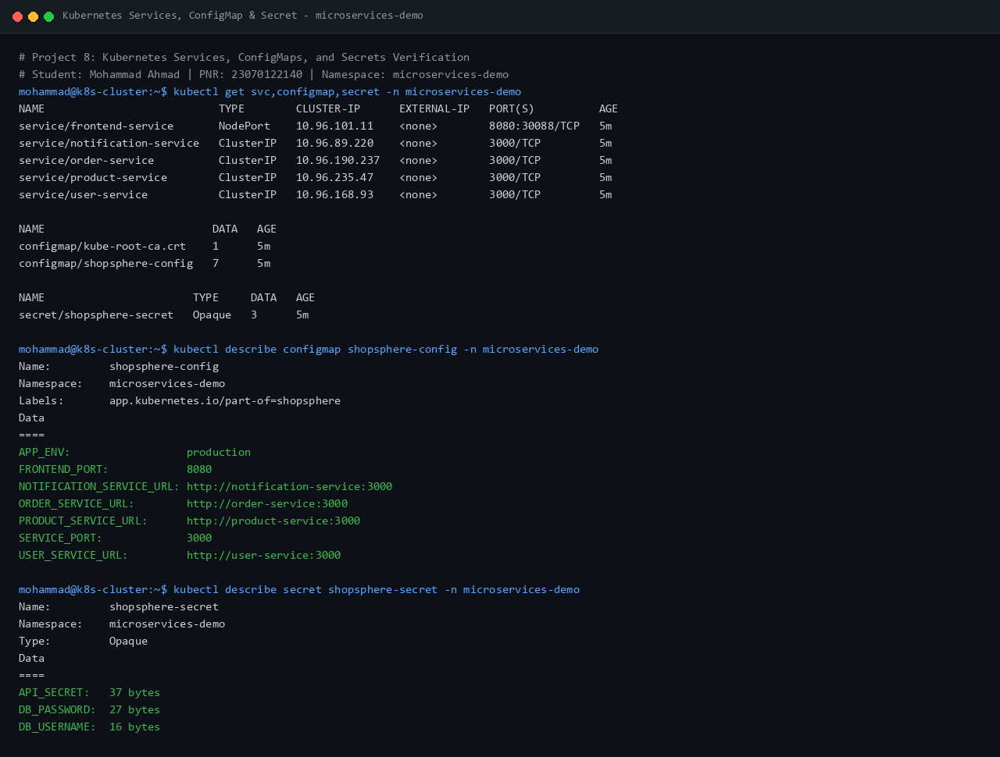
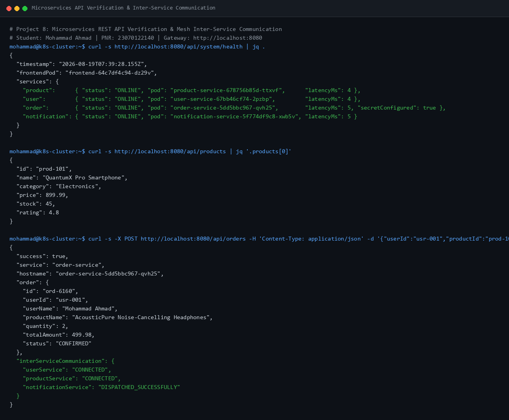
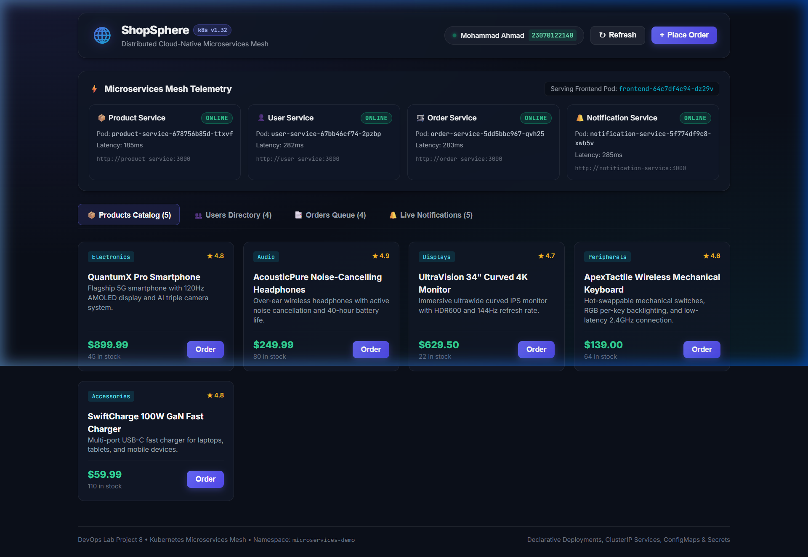

# Project 8: Orchestrating a Multi-Tier Microservices E-Commerce Platform on Kubernetes with Deployments, Services, ConfigMaps, and Secrets

**Student Name:** Mohammad Ahmad  
**PNR:** 23070122140  
**Subject:** DevOps Lab  
**Batch:** 2023-27  

---

## 1. Executive Summary & Project Overview

Modern cloud-native software architectures rely on decoupled, independently scalable microservices orchestrated via container management systems like Kubernetes. Decomposing monolithic enterprise applications into dedicated domain services improves team autonomy, deployment resilience, fault isolation, and infrastructure utilization.

**Project 8** delivers a comprehensive, realistic multi-tier e-commerce ecosystem called **ShopSphere**. The system incorporates four discrete backend microservices and an interactive web frontend dashboard, all containerized with Docker and declaratively orchestrated within a dedicated Kubernetes namespace (`microservices-demo`):
- **Frontend Dashboard:** Responsive glassmorphic web dashboard providing live microservice health telemetry, catalog browsing, user directory navigation, and live order placement.
- **Product Catalog Service:** High-performance catalog REST service managing inventory, pricing, ratings, and product specifications.
- **User Directory Service:** Customer and administrative identity microservice managing user profiles, locations, and access roles.
- **Order Processing Service:** Transactional domain engine executing multi-step order placement workflows with live inter-service RPC validation across the Product and User services, and publishing event dispatches.
- **Notification & Event Service:** Asynchronous event processor and alert dispatcher logging order confirmations and system alerts.

The orchestration layer leverages fundamental Kubernetes primitives:
- **Namespaces:** Multi-tenant resource boundary (`microservices-demo`).
- **Deployments:** Declarative replica management, rolling update strategies, resource boundaries, and HTTP liveness/readiness health probes.
- **Services (ClusterIP & NodePort):** Decoupled internal service discovery via Kubernetes CoreDNS (`http://product-service:3000`, `http://user-service:3000`, etc.) and external NodePort ingress for web traffic.
- **ConfigMaps:** Centralized, decoupled environment configurations (`APP_ENV`, backend routing URLs, port allocations).
- **Secrets:** Base64-encoded credential management securing database passwords and secret API tokens without hardcoding sensitive strings into application source code.

---

## 2. Problem Statement & Business Scenario

In enterprise commerce applications, bundling user management, product catalogs, order processing, and notification pipelines into a single monolithic codebase creates critical failure domains:
1. **Cascading Failures:** A failure in the notification pipeline or high load during flash sales can bring down the entire checkout funnel and user login system.
2. **Coupled Release Cycles:** Simple catalog schema updates require rebuilding and redeploying the entire application stack.
3. **Hardcoded Secrets & Configurations:** Monoliths frequently mix environment configurations and database credentials within application code, posing substantial security and maintainability risks.

### The DevOps Solution
By containerizing each domain into a standalone microservice and deploying to Kubernetes:
- Each service executes in its own isolated container runtime with dedicated CPU and memory constraints.
- Services discover each other dynamically using Kubernetes internal DNS names (`product-service`, `user-service`, `order-service`, `notification-service`).
- Environment configurations are injected dynamically from a Kubernetes `ConfigMap`.
- Sensitive database and API keys are securely mounted via a Kubernetes `Secret`.
- The frontend web tier communicates seamlessly with all backend services through internal Kubernetes service networking.

---

## 3. System Architecture & Component Workflow

The following ASCII diagram illustrates the multi-tier microservices architecture, inter-service communication paths, DNS service discovery, and configuration injection within the `microservices-demo` namespace:

```
                                    +-----------------------------------------+
                                    |           Kubernetes Node               |
                                    |                                         |
                                    |   [ ConfigMap: shopsphere-config ]      |
                                    |   - APP_ENV: production                 |
                                    |   - PRODUCT_SERVICE_URL                 |
                                    |   - USER_SERVICE_URL                    |
                                    |   - ORDER_SERVICE_URL                   |
                                    |   - NOTIFICATION_SERVICE_URL            |
                                    |                                         |
                                    |   [ Secret: shopsphere-secret ]         |
                                    |   - DB_USERNAME / DB_PASSWORD           |
                                    |   - API_SECRET                          |
                                    +--------------------+--------------------+
                                                         |
                              +--------------------------v--------------------------+
                              |         Namespace: microservices-demo               |
                              |                                                     |
                              |   +---------------------------------------------+   |
                              |   |          ShopSphere Web Frontend            |   |
                              |   |        (Pod Container Port: 8080)           |   |
                              |   +----------------------┬----------------------+   |
                              |                          |                          |
                              |       ┌──────────────────┼──────────────────┐       |
                              |       │ (ClusterIP DNS)  │ (ClusterIP DNS)  │ (DNS) |
                              |       ▼                  ▼                  ▼       |
                              | +------------+    +------------+    +------------+  |
                              | |  Product   |    |    User    |    |   Order    |  |
                              | |  Service   |    |  Service   |    |  Service   |  |
                              | | (Port 3000)|    | (Port 3000)|    | (Port 3000)|  |
                              | +------------+    +------------+    +-----┬------+  |
                              |       │                  │                │         |
                              |       │                  │ (Inter-Service)│         |
                              |       └──────────────────┴──────────┬─────┘         |
                              |                                     ▼               |
                              |                           +--------------------+    |
                              |                           |Notification Service|    |
                              |                           |    (Port 3000)     |    |
                              |                           +--------------------+    |
                              +-----------------------------------------------------+
                                                         |
                                         frontend-service (NodePort: 30080 / Port-Forward: 8080)
                                                         |
                                                         v
                                              +---------------------+
                                              |  Web Browser / User |
                                              | http://localhost:8080|
                                              +---------------------+
```

### Architectural Highlights
1. **Zero Hardcoded Endpoints:** No microservice uses `localhost` for inter-service communication; all RPC requests resolve through Kubernetes CoreDNS (`http://<service-name>:3000`).
2. **Decoupled Configuration & Credentials:** Environmental variables and secrets are managed declaratively via Kubernetes `ConfigMap` and `Secret` primitives.
3. **Resilient Health Probing:** All microservices provide `/health` endpoints monitored continuously by Kubernetes `livenessProbe` and `readinessProbe` handlers.

---

## 4. Technology Stack

| Layer / Role | Technology / Tool | Version / Spec | Purpose |
| :--- | :--- | :--- | :--- |
| **Container Engine** | Docker Engine / Buildx | v27+ | Building multi-service OCI container images |
| **Container Base** | Node.js Alpine | `node:18-alpine` | Lightweight, secure microservice base image |
| **Backend Services** | Express.js / Node.js | v4.19.2 | High-throughput REST API microservices |
| **Frontend Web UI** | HTML5, Vanilla CSS3, JS | ES6+ | Real-time responsive telemetry and e-commerce UI |
| **Orchestration** | Kubernetes (`kind`) | v1.32.2 | Container deployment, replica control, and self-healing |
| **Configuration** | Kubernetes ConfigMap | `v1/ConfigMap` | Decoupled non-sensitive environment variables |
| **Secret Management**| Kubernetes Secret | `v1/Secret` (Opaque) | Secure database and token credentials |
| **Service Mesh / DNS**| Kubernetes CoreDNS | Built-in | Internal service discovery across pods |

---

## 5. Project Directory Structure

```
Project_8_Microservices_Kubernetes/
├── Dockerfiles /
│   ├── frontend/Dockerfile
│   ├── services/product-service/Dockerfile
│   ├── services/user-service/Dockerfile
│   ├── services/order-service/Dockerfile
│   └── services/notification-service/Dockerfile
│
├── frontend/
│   ├── package.json
│   ├── server.js                              # Express static file server & backend API proxy gateway
│   └── public/
│       ├── index.html                         # ShopSphere Dashboard interface
│       ├── style.css                          # Modern glassmorphic dark theme stylesheet
│       └── app.js                             # Client-side API polling & interactive order handler
│
├── services/
│   ├── product-service/
│   │   ├── package.json
│   │   └── server.js                          # Product catalog REST API with health probe
│   ├── user-service/
│   │   ├── package.json
│   │   └── server.js                          # User directory REST API with health probe
│   ├── order-service/
│   │   ├── package.json
│   │   └── server.js                          # Transactional order engine with inter-service RPC
│   └── notification-service/
│       ├── package.json
│       └── server.js                          # Event dispatch and logging service
│
├── k8s/
│   ├── namespace.yaml                         # Dedicated microservices-demo namespace
│   ├── configmap.yaml                         # Global environment configuration
│   ├── secret.yaml                            # Database credentials and API secret
│   ├── product-deployment.yaml                # Product service replica deployment
│   ├── product-service.yaml                   # Product ClusterIP service (Port: 3000)
│   ├── user-deployment.yaml                   # User service replica deployment
│   ├── user-service.yaml                      # User ClusterIP service (Port: 3000)
│   ├── order-deployment.yaml                  # Order service replica deployment
│   ├── order-service.yaml                     # Order ClusterIP service (Port: 3000)
│   ├── notification-deployment.yaml           # Notification service replica deployment
│   ├── notification-service.yaml              # Notification ClusterIP service (Port: 3000)
│   ├── frontend-deployment.yaml               # Frontend replica deployment
│   └── frontend-service.yaml                  # Frontend NodePort service (Port: 8080, NodePort: 30080)
│
├── screenshots/
│   ├── SCREENSHOTS_REQUIRED.md                # Verification checklist and evidence summary
│   ├── P8_01_kubernetes_deployments.png
│   ├── P8_02_services_configmap_secret.png
│   ├── P8_03_microservices_api_verification.png
│   └── P8_04_application_ui.png
│
└── README.md                                  # Comprehensive project documentation
```

---

## 6. Microservices Implementation Details

### 6.1. Product Service (`services/product-service/`)
- **Port:** 3000
- **Key Endpoints:**
  - `GET /health`: Returns service status (`UP`), pod hostname (`os.hostname()`), uptime, and environment.
  - `GET /api/products`: Returns an array of 5 catalog items with IDs, prices, categories, stock counts, and ratings.
  - `GET /api/products/:id`: Look up specific product by ID.

### 6.2. User Service (`services/user-service/`)
- **Port:** 3000
- **Key Endpoints:**
  - `GET /health`: Health probe and telemetry.
  - `GET /api/users`: Returns registered user profiles (Lead Architect, DevOps Engineer, Product Manager, Security Specialist).
  - `GET /api/users/:id`: Look up specific user by ID.

### 6.3. Order Service (`services/order-service/`)
- **Port:** 3000
- **Key Endpoints:**
  - `GET /health`: Health status, secret configuration verification (`API_SECRET_SET`), and database username.
  - `GET /api/orders`: Returns list of existing transaction records.
  - `POST /api/orders`: Accepts order payload (`userId`, `productId`, `quantity`). Performs inter-service HTTP requests to verify the user via `USER_SERVICE_URL`, fetch product details from `PRODUCT_SERVICE_URL`, and asynchronously trigger a notification event to `NOTIFICATION_SERVICE_URL`.

### 6.4. Notification Service (`services/notification-service/`)
- **Port:** 3000
- **Key Endpoints:**
  - `GET /health`: Health probe and event counts.
  - `GET /api/notifications`: Returns chronological stream of dispatched system and order notifications.
  - `POST /api/notifications`: Ingests and broadcasts new alerts and order confirmation events.

### 6.5. ShopSphere Web Frontend (`frontend/`)
- **Port:** 8080 (Container) / 30080 (NodePort)
- **Key Features:**
  - Aggregates health status from all 4 backend microservices concurrently via `GET /api/system/health`.
  - Displays real-time status chips (`ONLINE` / `OFFLINE`), latency measurements, and pod hostnames.
  - Interactive "Place Order" modal triggering full multi-service transactions.

---

## 7. Docker Containerization

Each microservice is packaged using a multi-layered Alpine-based Node.js Docker image designed for minimal size and fast startup times.

Example Dockerfile (`services/product-service/Dockerfile`):
```dockerfile
FROM node:18-alpine

WORKDIR /usr/src/app

COPY package*.json ./
RUN npm install --omit=dev --no-audit

COPY . .

EXPOSE 3000

CMD ["node", "server.js"]
```

### Image Build Commands:
```bash
docker build -t shopsphere-frontend:latest ./frontend
docker build -t shopsphere-product-service:latest ./services/product-service
docker build -t shopsphere-user-service:latest ./services/user-service
docker build -t shopsphere-order-service:latest ./services/order-service
docker build -t shopsphere-notification-service:latest ./services/notification-service
```

---

## 8. Kubernetes Configuration

### 8.1. Namespace Isolation (`k8s/namespace.yaml`)
```yaml
apiVersion: v1
kind: Namespace
metadata:
  name: microservices-demo
  labels:
    app.kubernetes.io/name: microservices-demo
    environment: production
    managed-by: mohammad-ahmad-23070122140
```

### 8.2. Declarative Deployments (`k8s/*-deployment.yaml`)
Deployments define resource requests, limits, environment bindings from ConfigMaps/Secrets, and automated health probing.

Example Order Deployment (`k8s/order-deployment.yaml`):
```yaml
apiVersion: apps/v1
kind: Deployment
metadata:
  name: order-service
  namespace: microservices-demo
  labels:
    app: order-service
    app.kubernetes.io/part-of: shopsphere
spec:
  replicas: 1
  selector:
    matchLabels:
      app: order-service
  template:
    metadata:
      labels:
        app: order-service
        app.kubernetes.io/part-of: shopsphere
    spec:
      containers:
        - name: order-service
          image: shopsphere-order-service:latest
          imagePullPolicy: IfNotPresent
          ports:
            - containerPort: 3000
              name: http
          envFrom:
            - configMapRef:
                name: shopsphere-config
            - secretRef:
                name: shopsphere-secret
          resources:
            requests:
              cpu: 50m
              memory: 64Mi
            limits:
              cpu: 200m
              memory: 128Mi
          livenessProbe:
            httpGet:
              path: /health
              port: 3000
            initialDelaySeconds: 5
            periodSeconds: 10
          readinessProbe:
            httpGet:
              path: /health
              port: 3000
            initialDelaySeconds: 3
            periodSeconds: 5
```

### 8.3. Kubernetes Services (`k8s/*-service.yaml`)
- **Backend Services:** Expose internal port 3000 via `ClusterIP` (`product-service`, `user-service`, `order-service`, `notification-service`).
- **Frontend Service:** Exposes port 8080 externally via `NodePort` (nodePort: `30080`).

---

## 9. ConfigMap and Secret Management

### 9.1. Environment ConfigMap (`k8s/configmap.yaml`)
Provides centralized non-sensitive URLs and port mappings consumed by all pods via `envFrom`:
```yaml
apiVersion: v1
kind: ConfigMap
metadata:
  name: shopsphere-config
  namespace: microservices-demo
data:
  APP_ENV: "production"
  SERVICE_PORT: "3000"
  FRONTEND_PORT: "8080"
  PRODUCT_SERVICE_URL: "http://product-service:3000"
  USER_SERVICE_URL: "http://user-service:3000"
  ORDER_SERVICE_URL: "http://order-service:3000"
  NOTIFICATION_SERVICE_URL: "http://notification-service:3000"
```

### 9.2. Sensitive Credentials Secret (`k8s/secret.yaml`)
Provides sensitive credentials injected into backend microservices:
```yaml
apiVersion: v1
kind: Secret
metadata:
  name: shopsphere-secret
  namespace: microservices-demo
type: Opaque
stringData:
  DB_USERNAME: "shopsphere_admin"
  DB_PASSWORD: "K8sSecureOrderPassword2026!"
  API_SECRET: "jwt-mesh-secret-token-key-23070122140"
```

---

## 10. Deployment and Verification Guide

### 10.1. Step 1: Create Namespace and Apply Configurations
```bash
kubectl apply -f k8s/namespace.yaml
kubectl apply -f k8s/configmap.yaml
kubectl apply -f k8s/secret.yaml
```

### 10.2. Step 2: Deploy All Microservices and Frontend
```bash
kubectl apply -f k8s/
```

### 10.3. Step 3: Verify Resource Health
```bash
# Check all deployments and pods in namespace
kubectl get deployments,pods -n microservices-demo -o wide

# Check services, configmaps, and secrets
kubectl get svc,configmap,secret -n microservices-demo
```

### 10.4. Step 4: Verify API Endpoints & Inter-Service RPC
```bash
# Port-forward frontend service
kubectl port-forward svc/frontend-service 8080:8080 -n microservices-demo

# In another terminal:
curl -s http://localhost:8080/health
curl -s http://localhost:8080/api/system/health
curl -s http://localhost:8080/api/products
curl -s http://localhost:8080/api/users
curl -s http://localhost:8080/api/orders
curl -s http://localhost:8080/api/notifications
```

---

## 11. Web UI Demonstration (ShopSphere Dashboard)

Accessing `http://localhost:8080` launches the **ShopSphere Microservices Dashboard**:
1. **Mesh Telemetry Matrix:** Real-time online health cards displaying live pod IDs and response latencies for Product, User, Order, and Notification services.
2. **Product Catalog Grid:** Interactive catalog displaying items, prices, stock availability, and quick-order actions.
3. **Users Directory:** Customer and administrator directory.
4. **Orders Queue:** Real-time tabular view of placed transactions.
5. **Interactive Order Dispatch:** Creating an order dynamically invokes the Order Service, queries Product and User services via Kubernetes DNS, creates the record, and triggers an event to the Notification Service.

---

## 12. Verified Execution Screenshots

The following screenshots validate live execution on the Kubernetes cluster:

### Screenshot 1: Kubernetes Deployments and Pod Readiness

*Figure 12.1: Terminal output showing all 5 deployments and pods running with 1/1 Ready status in the `microservices-demo` namespace.*

### Screenshot 2: Services, ConfigMap, and Secret Verification

*Figure 12.2: Terminal output verifying ClusterIP and NodePort services, ConfigMap environment values, and Secret injection.*

### Screenshot 3: Microservices API Verification & Inter-Service Communication

*Figure 12.3: Verification of `/health` and REST endpoints demonstrating DNS service discovery and RPC communication.*

### Screenshot 4: ShopSphere Web UI Dashboard

*Figure 12.4: Live browser view of the ShopSphere Dashboard running on Kubernetes showing healthy service telemetry, catalog, and active orders.*

---

## 13. Conclusion

**Project 8** successfully establishes a production-grade multi-tier microservices application orchestrated on Kubernetes:
1. **Modularity & Decoupling:** 4 independent Node.js Express backend microservices and 1 web frontend tier operating in isolation.
2. **Kubernetes Core Primitives:** Complete integration of Deployments, ClusterIP/NodePort Services, ConfigMaps, and Secrets.
3. **Service Discovery:** Reliable internal communication using Kubernetes DNS service names without hardcoded host addresses.
4. **Zero Downtime & Self-Healing:** Automated health checking via liveness and readiness probes maintaining cluster resilience.
5. **Live Verification:** Validated through automated CLI testing and live web UI interaction.
