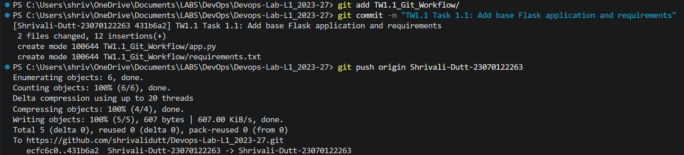
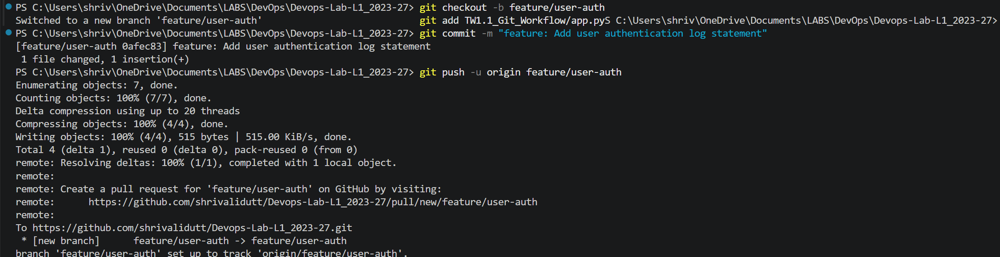
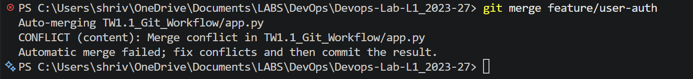
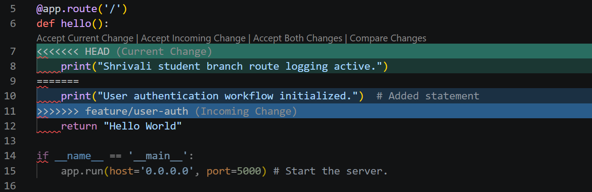
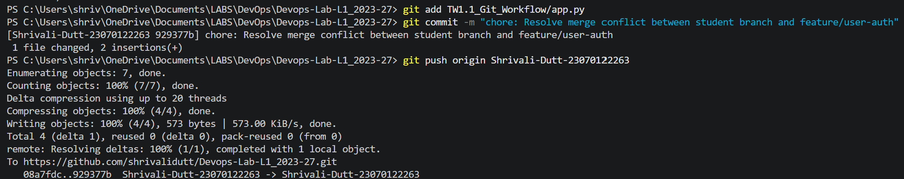

# TW1.1: Git Workflow & Merge Conflict Resolution

**Student Name:** Shrivali Dutt  
**PRN:** 23070122263  

---

## 📝 Overview
This task demonstrates setting up feature branches, introducing conflicting changes, manually resolving merge conflicts in code, and pushing the merged history.

## 🛠️ Step-by-Step Execution & Evidence

### Step 1: Base Application Setup
Pushed the initial Flask application (`app.py`) and dependencies to the student branch.

---

### Step 2: Feature Branch Creation
Created and pushed the `feature/user-auth` branch to implement user authentication logging.

---

### Step 3: Merge Conflict Triggered
Attempted to merge `feature/user-auth` into the student branch, triggering a content conflict in `app.py`.

---

### Step 4: Resolving Conflicts in VS Code
Inspected and manually edited the conflict markers (`<<<<<<< HEAD` vs `>>>>>>> feature/user-auth`) in VS Code.

---

### Step 5: Final Resolution Commit
Staged the resolved file, committed the merge fix, and pushed to GitHub.

