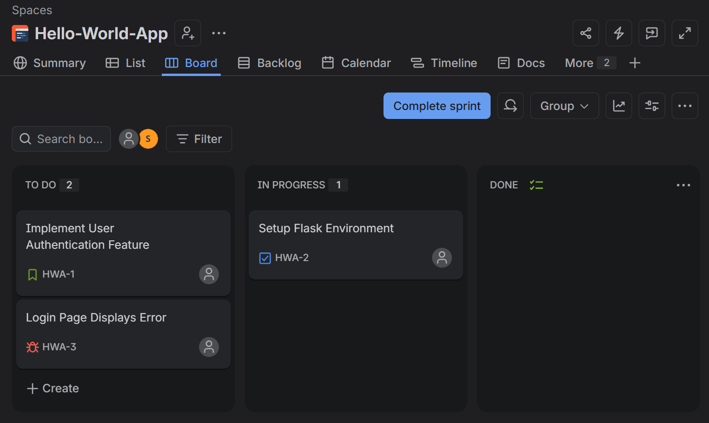

# TW1.1: Git Workflow & Merge Conflict Resolution

**Student Name:** Shrivali Dutt  
**PRN:** 23070122263  

---

## 📝 Overview
This module demonstrates working with structured Git workflows, feature branching, and manual merge conflict resolution.

## 🛠️ Work Done
1. Created feature branches off the primary repository branch.
2. Intentionally introduced conflicting edits across branches in application files.
3. Handled merge conflicts manually, verified clean code state, and completed the merge commit.

## 📸 Evidence & Screenshots

### 1. Merge Conflict Detected

### 2. Conflict Resolved & Merged
