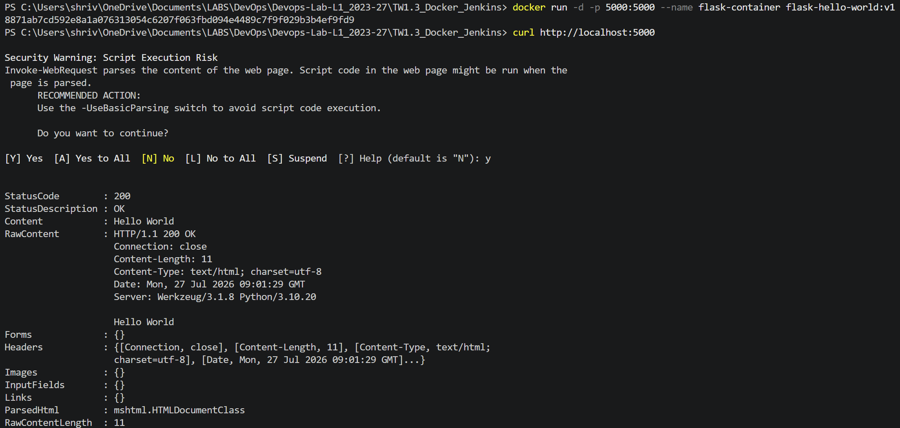
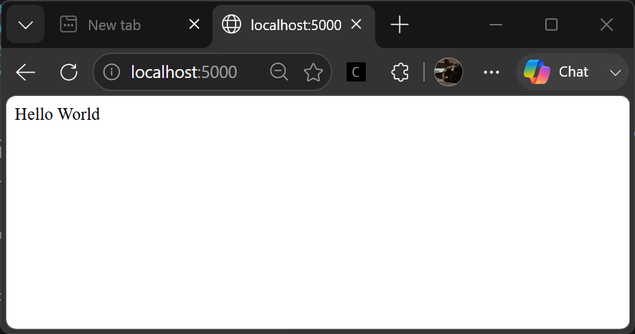

# TW1.3: Docker Containerization & Jenkins CI Pipeline

**Student Name:** Shrivali Dutt  
**PRN:** 23070122263  

---

## 📝 Overview
This task covers containerizing a Flask web application with Docker and automating build verification using a Jenkins Freestyle CI pipeline.

## 🛠️ Step-by-Step Execution & Evidence

### Task 3.1: Docker Container Deployment & Testing
1. Built image `flask-hello-world:v1` using `dockerfile`.
2. Started container `flask-container` on port `5000`.
3. Verified local endpoint response using PowerShell `curl`.

#### Terminal Verification:

#### Browser Verification (`http://localhost:5000`):

---

### Task 3.2: Jenkins Freestyle CI Pipeline
1. Configured job `TW1.3-Flask-Freestyle` pulling from branch `Shrivali-Dutt-23070122263`.
2. Added shell command `ls -la` to verify workspace files.
3. Executed build `#1` and verified `Finished: SUCCESS`.

#### Build Console Output:

