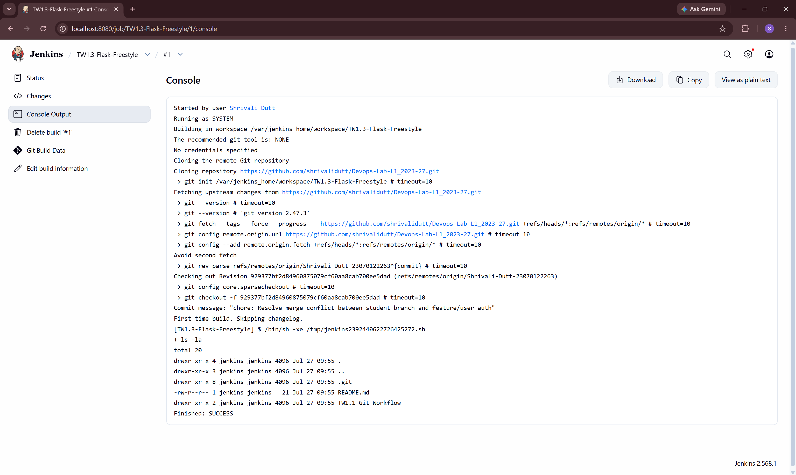

# TW1.3: Docker Containerization & Jenkins CI Pipeline

**Student Name:** Shrivali Dutt  
**PRN:** 23070122263  

---

## 📝 Overview
This module covers application containerization using Docker Desktop and continuous integration pipeline automation using Jenkins Freestyle jobs.

## 🛠️ Work Done
* **Task 3.1 (Docker):**
  * Created a lightweight Python Flask application (`app.py`) and defined dependencies in `requirements.txt`.
  * Authored a multi-stage `dockerfile` based on `python:3.10-alpine`.
  * Built container image `flask-hello-world:v1` and verified endpoint execution on port `5000`.

* **Task 3.2 (Jenkins CI):**
  * Spun up a Jenkins server instance via Docker on port `8080`.
  * Created a Freestyle job (`TW1.3-Flask-Freestyle`) bound to the GitHub repository branch `Shrivali-Dutt-23070122263`.
  * Executed workspace checkout and verified build step completion with `SUCCESS`.

## 📸 Evidence & Screenshots

### 1. Task 3.1 — Docker Container Run & Curl Test

### 2. Task 3.2 — Jenkins Build Console Output
